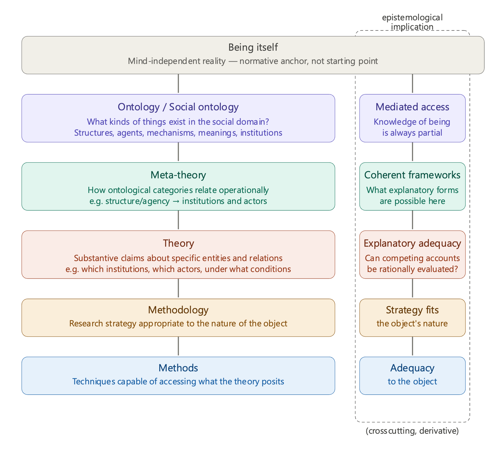

# Chapter 2: Ontology, Epistemology, Causality, and Emergence

Chapter 1 established the philosophical stakes of social research: the difficulties created by the empiricist tradition, the ontological responses it provoked, and the confusions that arise when quantification is conflated with objectivity and when methods are treated as adequate independently of the objects they investigate. That chapter traced the problem. The present chapter addresses the conceptual architecture required to move beyond it.

Three sets of conceptual distinctions structure the argument. The first concerns the relationship between ontology, epistemology, methodology, and methods, and the priority that must be accorded to ontological questions before methodological ones can be coherently addressed. The second concerns causality: the range of positions available in the philosophical literature and the specific demands that open social systems place on any adequate account of causal explanation. The third concerns emergence and the three broad approaches to it that have shaped how social science accounts for collective properties and their causal powers. Together these three sets of distinctions constitute the conceptual foundation on which the four social ontological debates examined in Part II rest.

## 2.1 Ontology, Epistemology, Methodology, and Methods: Critical Realist Definitions

2.1.1 The Problem of Conflation and the Case for Ontological Priority

Social research is marked by a persistent and largely unresolved methodological debate: are quantitative or qualitative approaches more appropriate for the study of social life? Proponents of quantitative methods argue that only systematic measurement and statistical inference can produce generalisable knowledge, while proponents of qualitative methods insist that the complexity and meaning-laden character of social reality requires interpretive, context-sensitive investigation. What is rarely noticed is that this debate cannot be resolved at the methodological level at all, because the disagreement is not fundamentally about techniques or even about research strategies. It is about what social reality is like and what kind of knowledge of it is possible. Researchers argue past each other because they are answering different questions while assuming they are answering the same one.

This conflation is not incidental. It reflects a deeper tendency in social research to collapse distinct dimensions of inquiry into one another, most commonly by treating questions about what exists as if they were questions about how we can know. When a researcher chooses a survey because “that is how social scientists study this topic,” or adopts ethnography because “numbers cannot capture meaning,” the methodological choice is being driven by disciplinary convention or epistemological intuition rather than by any explicit account of what kind of thing is being investigated. The result is that ontological commitments remain implicit and unexamined, which means they cannot be critically assessed or revised. Making these commitments explicit, and understanding how they relate to epistemological, methodological, and methods choices, is what ontological analysis enables.

To understand why ontological commitments must come first, however, we need to ask a prior question: what would have to be the case for any of this to matter? For theoretical disagreement to be a genuine disagreement, for one account to be more adequate than another and for research to be capable of discovering that previous theories were wrong, there must be something that theories are about that is not itself produced by the theories. If the social world were simply constituted by our descriptions of it, then changing descriptions would change reality, and no description could be more or less adequate than any other. The fact that social researchers do revise their theories in response to what they find, that interventions based on inadequate theoretical understanding demonstrably fail, and that some explanations prove more powerful than others across independent lines of evidence, all of this presupposes that there is a reality that exists and operates independently of our knowledge of it. This is not an assumption that has to be accepted on faith; it is what must be the case for scientific inquiry, including the possibility of being wrong, to be intelligible at all. It is this transcendental argument, moving from the undeniable features of scientific practice to the conditions that make them possible, that Bhaskar’s critical realism places at its foundation (Bhaskar, 1975).

This does not require claiming that we have unmediated access to reality as it is. Quite the contrary: our knowledge of reality is always historically produced, theoretically mediated, and subject to revision. What the argument establishes is a distinction between two dimensions that must be kept apart if social research is to remain coherent. The first is the intransitive dimension: reality as it exists and operates independently of our knowledge of it, the structures, mechanisms, relations, and entities that have causal powers whether or not we have theorised them adequately. The second is the transitive dimension: the historically developing body of theories, concepts, models, and explanatory frameworks through which we attempt to understand that reality. These two dimensions are irreducible to one another. The intransitive dimension does not change because our theories change; the transitive dimension is always our current best approximation of what the intransitive dimension contains, not a mirror of it. Scientific progress consists precisely in developing transitive knowledge that increasingly adequately captures the intransitive dimension, even though this remains fallible and subject to revision (Bhaskar, 1975, 1979).

It is worth noting that the intransitive dimension is not a starting point that researchers occupy before theorising. It is an anchor: the standard against which the adequacy of transitive knowledge is measured, and the condition of possibility for theoretical revision, rational comparison of competing accounts, and the explanation of why some interventions work while others fail. This distinction between the intransitive and transitive dimensions is what makes ontological priority both possible and necessary: because reality exists independently of our knowledge of it, ontological commitments about what that reality contains must come before, and constrain, the epistemological, meta-theoretical, theoretical, methodological, and methods choices through which we attempt to know it. How these dimensions relate to one another, and why getting their relationships right matters for social research, is the subject of the sections that follow.

2.1.2 From the Intransitive Dimension to the Architecture of Social Research

The intransitive/transitive distinction establishes that reality exists independently of our knowledge of it, and that our knowledge is always a historically situated and fallible attempt to approximate that reality. But this immediately raises a further question: what kinds of things does the intransitive dimension contain, at least in the social domain? Not all of reality is relevant to social research in the same way. The social world has a specific character, populated by specific kinds of entities with specific kinds of properties and causal powers. Identifying what those entities are, how they exist, and how they relate to one another is the task of social ontology. **Ontology** is the study of what exists, how different aspects of reality are constituted, and what properties and causal powers they possess. It is important to distinguish ontology as a philosophical discipline from being itself: ontology does not refer to mind-independent reality as such but to our systematic theorisation of what that reality looks like in its most fundamental form. When researchers grapple with ontological questions in the social domain, they are asking: what kinds of entities exist in social reality? Do individual persons, social structures, cultural meanings, and institutional arrangements all exist independently and with their own causal powers, or can some be reduced to others? How do different aspects of social reality relate to and act upon one another? These are not questions about how we know social reality but about what it is, and the answers researchers give to them, whether explicitly or implicitly, shape everything that follows (Bhaskar, 1975, 1979).

**Social ontology** is the domain-specific application of these questions to social life: a theorisation of what the intransitive dimension contains when the object of investigation is the social world. It identifies the kinds of entities, structures, mechanisms, and relations that are present and causally operative in that domain. But identifying what exists in the social domain does not yet tell us how those entities relate to one another in ways that could generate the social outcomes we observe. If social ontology establishes that both structures and agents exist as real and causally efficacious, we face an immediate and non-trivial problem: how do these kinds of things relate to one another such that their interaction can generate social outcomes, and what does that mean for how explanations must be constructed?

**Meta-theory** takes the categories established at the ontological level and specifies how they relate operationally, determining the form that explanation must take without yet making any substantive claims about specific entities or mechanisms in any particular context. If social ontology establishes that structure and agency are both real and irreducible, meta-theory translates this into a formal explanatory requirement: explanations must be structured in terms of how institutional arrangements condition the action of actors, and how that action in turn reproduces or transforms those arrangements. Meta-theory specifies the causal logic connecting the ontological categories, the analytical units through which their interaction can be investigated, and the relational form that an adequate explanation must take. It is the intermediate level that makes the move from ontological commitment to substantive theoretical claim coherent rather than arbitrary, and it is what prevents theoretical frameworks from being constructed in ways that are inconsistent with the ontological commitments researchers claim to hold (Archer, 1995; Danermark et al., 2002). Having established the form explanation must take, we can now ask what it must say: what are the specific entities, mechanisms, and conditions that generate the outcomes we are investigating?

**Theory** makes substantive claims about specific entities, relations, and mechanisms within the domain identified by social ontology and within the formal constraints established by meta-theory. Theoretical questions ask which institutions, which actors, under what conditions, and through what mechanisms particular social outcomes are generated. Theory is evaluated against the ontological referent that the intransitive dimension provides: competing theoretical accounts are not simply different perspectives but different attempts to capture what is actually operative in the intransitive dimension, and they can therefore be assessed in terms of their explanatory power, their coherence with evidence, and their capacity to account for why interventions based on them succeed or fail (Bhaskar, 1979; Sayer, 2000). It is at this point that the distinction between meta-theory and theory becomes fully visible. Meta-theory specifies the form of explanation: for example, that explanations must account for how structural conditions and agentive action interact across time. Theory fills that form with content: these specific institutional arrangements, operating through these specific mechanisms, conditioned the actions of these specific groups under these specific historical conditions. Two researchers who share the same ontological commitments may nonetheless develop different meta-theoretical frameworks, not because they are studying different phenomena, which would be a theoretical rather than a meta-theoretical consideration, but because they hold different views about the causal logic connecting the categories they both accept. One may emphasise the temporal sequencing of structure and agency as analytically separable moments; another may emphasise their recursive mutual constitution. These are genuinely different meta-theoretical positions that carry different implications for the kinds of theoretical claims that are coherent within them (Archer, 1995). But having an adequate theoretical account of what mechanisms exist and how they operate does not yet tell us how to investigate them. Mechanisms are typically not directly observable; they operate at a level of depth that makes them inaccessible to straightforward empirical inspection. How, then, do we design research that can reach them?

**Methodology** addresses which research *strategy* is appropriate to the nature of the object being investigated. The appropriate strategy is not determined by what is most efficient, most consistent with disciplinary convention, or most likely to produce publishable results, but by what the object requires. A mechanism that operates through the interpretive frameworks of agents requires a different investigative strategy than one that operates through material resource distribution, not because one strategy is more rigorous than the other, but because the nature of the object constrains what kind of access is possible. Methodological choices must therefore flow from ontological and meta-theoretical commitments rather than from the availability of data or the expectations of disciplinary audiences (Sayer, 2000; Danermark et al., 2002). Knowing what strategy is appropriate, however, still leaves open the question of which specific techniques are capable of executing that strategy and generating empirical material that bears on the theoretical claims being evaluated.

**Methods** are the specific techniques through which empirical material is generated and analysed. The critical question at the methods level is whether a given technique is adequate to the object: whether it can reach the kind of entity, mechanism, or relation the theoretical account identifies as causally relevant. This is what makes the quantitative/qualitative distinction a derivative rather than a foundational one. The question is never simply whether to count or to interpret, but whether the technique chosen is capable of accessing what the theory posits as existing in the intransitive dimension. A technique that can only document regularities at the surface of social life is inadequate if the theoretical account identifies depth mechanisms as causally primary; a technique designed to access subjective meaning is inadequate if the object is a structural mechanism that operates independently of whether agents are aware of it (Sayer, 2000).

Running through all of these dimensions, but irreducible to any one of them, is **epistemology**. Epistemology addresses how we can gain knowledge about what exists and what constitutes adequate justification for knowledge claims. It is important to distinguish epistemology as a philosophical discipline from knowledge itself, which can be understood as the actually existing body of theories, concepts, and explanatory frameworks that scientific communities produce at any given historical moment. Knowledge itself belongs to the transitive dimension; epistemology is the reflexive account of how that knowledge is produced, evaluated, and revised. Epistemology does not occupy a single position in the architecture described here. Rather, its implications are felt at every level, taking a different form as we move from ontology toward methods. At the ontological level, the epistemological implication is that our access to being itself is always mediated and partial: social ontological commitments are not direct readings of reality but theoretically informed and historically situated accounts, which means they must be held critically and remain open to revision. At the meta-theoretical level, epistemology constrains which explanatory frameworks are coherent: not all ways of relating ontological categories are equally justified, and the epistemological question is whether a given meta-theoretical framework can produce knowledge adequate to the entities it purports to explain. At the theoretical level, epistemology shapes what counts as evidence and what inference patterns are legitimate given the ontological and meta-theoretical commitments in play: different theoretical frameworks do not simply collect different kinds of data, they operate with different standards of what evidence is and what it can show. At the methodological level, epistemology specifies what a research strategy must be capable of producing, if it is to generate knowledge relevant to the theoretical claims being made. At the methods level, finally, epistemology underscores the standard of adequacy: a method is justified not because it meets abstract criteria imported from a different domain of inquiry, but because it is capable of generating knowledge of the specific kind of object the theory identifies. Epistemology is therefore derivative in a precise sense: the epistemological questions that arise at each level are determined by the ontological and meta-theoretical commitments made there, which is why ontology must come first, and why the collapse of ontological into epistemological questions systematically distorts social research. That distortion, and the argument against it, is developed in the section that follows.

The relationships between these dimensions, and the derivative crosscutting role of epistemology, are represented in Figure 2.1.

2.1.3 Why Social Research Needs an Ontological Referent

The architecture described in section 2.1.2 rests on a foundational claim: that the intransitive dimension provides a shared referent against which the adequacy of transitive knowledge can be assessed. This claim is not self-evident, and it requires defence. The social world is complex, contested, and epistemically unstable: new forms of social organisation emerge, existing arrangements are transformed, and the conceptual frameworks through which researchers make sense of social life are themselves historically situated and subject to revision. In such conditions, it might seem more honest to abandon the idea of an ontological referent altogether and to treat social research as a conversation between competing perspectives, each capturing something real about a domain that resists any single adequate description. This position has considerable appeal, and versions of it inform influential traditions in social research, from interpretivism to strong constructivism. The argument of this section is that such a position cannot be sustained, not because it is naively wrong, but because it is self-undermining: the practices it relies on to distinguish better from worse social research already presuppose the ontological referent it claims to dispense with (Bhaskar, 1979; Sayer, 2000).

Consider what social researchers actually do when they evaluate competing accounts of the same phenomenon. When sociologists debate whether cultural or economic mechanisms better explain educational inequality, they do not simply note that the two accounts reflect different theoretical frameworks or different disciplinary traditions. They examine evidence about how mechanisms actually operate: whether cultural capital provides advantages independently of economic resources, whether economic barriers constrain opportunities regardless of cultural knowledge, whether interventions targeting one dimension without addressing the other succeed or fail. These are questions about what is actually happening in the social world, not about which theoretical framework is more internally coherent or more consistent with a particular epistemological tradition. However, the evaluation of competing theories in this way only makes sense if there is something that both theories are attempting to explain, something that exists and operates independently of either theoretical account, and that therefore provides a standard against which their relative adequacy can be assessed. Without an ontological referent, this kind of rational theoretical evaluation becomes impossible: competing accounts can only be assessed against each other, which means the choice between them reduces to coherence, consistency with prior commitments, or the social authority of those who advance them (Bhaskar, 1979; Danermark et al., 2002).

The same point can be made from the direction of theoretical revision. Social research does not merely accumulate perspectives; it discovers errors. Early deficit theories attributing educational inequality to the cultural deprivation of disadvantaged groups proved inadequate not because a more fashionable theoretical framework displaced them, but because interventions based on them failed to close achievement gaps, and because subsequent research identified structural tendencies that the deficit framework had systematically obscured. Human capital approaches that emphasised individual skill development similarly proved unable to account for the persistence of inequality among equally qualified individuals from different social backgrounds, which pointed toward mechanisms operating at a structural level that the framework had no resources to identify. These are genuine theoretical revisions, not mere shifts in perspective, and they are only intelligible as revisions if there is a reality that previous theories failed to adequately capture and that subsequent theories approximate more closely (Lareau, 2011; Pawson and Tilley, 1997). A purely epistemological starting point cannot account for this: if social reality is constituted by our descriptions of it, then changing descriptions do not reveal errors in previous accounts but simply produce a different social reality, and the notion of theoretical progress becomes incoherent.

This is the core of what Bhaskar calls the epistemic fallacy: the reduction of ontological questions to epistemological ones, or the treatment of claims about what exists as equivalent to claims about what we can know (Bhaskar, 1975). The epistemic fallacy does not require an explicit philosophical commitment to idealism or relativism; it operates implicitly whenever researchers treat their theoretical frameworks as constitutive of the phenomena they study rather than as fallible attempts to capture independently existing mechanisms. Its consequences are systematic. First, it makes the identification of theoretical errors impossible: if reality is constituted by our frameworks, frameworks cannot be wrong about reality, only internally inconsistent or pragmatically unhelpful. Second, it renders rational comparison of competing theories incoherent: without a shared referent, theoretical choice depends on power, persuasion, or arbitrary preference rather than on explanatory adequacy. Third, it undermines the possibility of realism itself: if we cannot distinguish what exists from what we know about what exists, then the claim that reality operates independently of our knowledge becomes unstateable, and social research collapses into a form of constructivism that cannot account for its own practice (Bhaskar, 1975, 1979).

It is important to be precise about what the ontological referent does and does not claim. It does not claim that researchers have unmediated access to social reality, or that any particular theoretical account has captured it definitively. The intransitive dimension is not a transparent object available for direct inspection; it is always approached through the transitive dimension, through historically situated and theoretically mediated frameworks that remain fallible and subject to revision. What the ontological referent claims is more modest but more fundamental: that there is something that our theories are about, that this something exists and operates independently of our theories, and that this independence is what makes theoretical revision, rational comparison, and the identification of error possible at all. The referent is in principle unknown and our theories of what it is can be flawed, however it is a real, efficacious and in fact necessary thing, as it is the response to the transcendental question of "what is it that enables/makes possible for x phenomenon to happen?" Critical realism therefore combines ontological realism, the commitment that the intransitive dimension exists independently of our knowledge, with epistemological relativism, the recognition that our transitive knowledge of it is always fallible and historically situated, and with what Bhaskar calls judgmental rationality, the capacity to assess competing theories against a shared referent even while acknowledging the fallibility of that assessment (Bhaskar, 1979; Archer et al., 1998).

The need for an ontological referent has a further implication that is specific to social research. Unlike the objects of natural science, social structures exist only through the ongoing activity of the agents they condition, and social meanings are constitutively dependent on the interpretive frameworks of those who hold them. This might seem to support the view that social reality is constituted by the descriptions we give of it, since social objects appear to be more intimately bound up with human conceptual activity than natural ones. But this conflates two distinct points. The first is that social objects are concept-dependent in their constitution: institutions, norms, and cultural meanings require shared interpretive frameworks to exist as the kinds of things they are. The second is that social objects are constituted by researchers’ theoretical descriptions of them, which does not follow from the first. An institution can be concept-dependent in its constitution while still existing independently of any particular researcher’s theoretical account of it, generating real effects on the agents it conditions regardless of whether those effects are adequately theorised by social scientists. The concept-dependence of social objects is therefore an ontological feature of the social domain that a critical realist social ontology must incorporate, not a reason to abandon the ontological referent altogether (Bhaskar, 1979; Sayer, 2000). How the social domain is specifically constituted, and what distinctive challenges this poses for ontological analysis, is the subject of section 2.3.

## 2.2 Causality in Social Research: From Philosophical Foundations to Contemporary Debates

Having established the architecture that runs from ontology through meta-theory and theory to methodology and methods, we now turn to causality: the dimension of ontology that most directly shapes what researchers accept as explanation. We do so by examining how different philosophical traditions have conceptualized causal relationships. Causality refers to how things affect each other, or the relationship through which social entities, such as objects, processes, and mechanisms, create the conditions of possibility for phenomena to happen. Causal explanation therefore seeks to identify what produces outcomes (whether observable or not), rather than simply describing patterns or correlations. What counts as causal explanation, however, depends on ontological commitments regarding time, space, and the structure of reality.

Because the accounts examined below repeatedly invoke commitments about time, two distinctions are worth introducing here in preliminary form; they receive full treatment in Chapter 9. The first concerns what exists in time. Presentism holds that only the present is real, so that the past and future have no existence beyond their traces in, and anticipations from, the present. Eternalism holds that past, present, and future are all equally real. A related distinction concerns persistence: endurantist accounts hold that entities exist wholly at each moment of their existence, while perdurantist accounts treat entities as extended through time, existing as a series of temporal parts. The second distinction concerns how analysis engages time: synchronic analysis examines how a phenomenon is organised at a given moment, while diachronic analysis traces how it developed and changed over time. Positions on the first distinction shape which mode of analysis can carry explanatory weight. If only the present is real, historical analysis can at most identify antecedent conditions of present arrangements; if the past persists in structures that operate now, diachronic analysis becomes indispensable to causal explanation.

Parallel distinctions apply to space. Absolute conceptions treat space as a container that exists independently of the objects and processes within it, a neutral stage on which social life unfolds. Relational conceptions treat space as constituted by the relationships between entities and as actively produced through social practice, so that spatial arrangements are both an outcome and a medium of social processes (Massey, 2018). These commitments matter for causal explanation because they determine whether proximity, distance, and location can themselves do causal work or merely describe where causes happen to operate. With these preliminary distinctions in hand, the positions that follow can be located not only by what they say about causation but by the ontologies of time and space they presuppose.

2.2.1 Mechanical and Mathematical Causality – Descartes and Newton

Early modern science redefined the concept of causality by replacing ancient purpose-based explanations (Aristotle) with mechanical explanations. In mechanical philosophy, associated with Descartes (see Chapter 1), causal relations involve direct interaction determined by necessity: objects transmit motions through contact; thus, the world is conceived as a system of interacting parts, operating according to deterministic laws. Consequently, if all initial conditions and laws are known, future states can be predicted with certainty. Causality is therefore deterministic, based on physical interaction (Cohen, 1999). This deterministic conception of causality aligns with the understanding of time as a continuous flow (aligning with Eternalism) and space as a container within which objects move and interact (aligning with absolute space).

The purpose-based explanation that early modern science displaced deserves a brief statement, because it remains a live resource for social research. Aristotle distinguished four kinds of cause, four ways of answering the question ‘why?’: the material cause (what something is made of), the formal cause (the form or organisation that makes it the kind of thing it is), the efficient cause (the agent or process that brings it about), and the final cause (the end or purpose toward which it tends) (Aristotle, 1996, Physics II.3; Groff, 2013). Modern science retained only the efficient cause, treating explanation as the identification of antecedent events that bring about their effects. Yet social phenomena often seem to demand the fuller Aristotelian repertoire: institutions are partly explained by how they are organised (formal), by the resources they mobilise (material), and by the purposes they serve (final), not only by the events that trigger their operation. Several of the positions examined later in this chapter, particularly the modal theories that attribute powers and tendencies to structured entities, can be read as recovering aspects of this richer causal vocabulary.

Newton extends this perspective by demonstrating that causal relationships can be expressed mathematically. For instance, gravity can be described through precise equations allowing accurate prediction of planetary motion, even if the underlying mechanism remained unknown. Causality thus became associated with law-governed regularity and predictive power. This achievement established that causal laws describing relationships between observable phenomena prove sufficient for scientific explanation even when underlying causal mechanisms remain unknown (Cohen, 1999).

These developments established a powerful image of causality: deterministic, law-like, and ideally predictive. However, both approaches faced questions about whether such frameworks could explain phenomena involving purposes, meanings, and agency that appeared irreducible to mechanical necessity or mathematical laws.

2.2.2 Causality as Regularity – Hume

Hume subjected causal reasoning to a critique that continues to shape philosophical debate (see Chapter 1). His analysis is frequently read as the founding statement of regularity theory, yet his own position is more equivocal than this reception suggests. Hume argued that when we observe what we call a causal relation, we never actually perceive any necessary connection between cause and effect; we observe only that one type of event regularly follows another. From repeated experience of such constant conjunction, we develop the expectation that similar antecedents will produce similar consequents, but this expectation is a product of psychological habit rather than rational inference or direct perception of causal power (Hume, 1748/2000). Necessity, on this account, is not a feature of the world we discover through observation but a projection of the mind formed through accumulated experience.

What is often overlooked, however, is that Hume himself was deeply troubled by this conclusion. He did not straightforwardly endorse regularity as an adequate account of causation; he used it to expose the limits of what causal reasoning can claim to establish. His sceptical point was precisely that we cannot justify our inductive inferences from observed regularities to unobserved cases, because no logical argument can demonstrate that the future must resemble the past. The problem of induction, as it came to be known, is not a solution to the question of causation but a challenge to any confident causal claim (Hume, 1739/2000). What we can know, Hume concluded, is confined to what experience presents: the observed patterns of succession that form the practical basis of everyday and scientific reasoning, without any metaphysical guarantee underlying them.

This regularity conception carries important implications for how time and space enter causal explanation. If causation consists in regular succession, temporal order becomes essential to identifying causal direction: a cause must precede its effect, and the sequence of events provides the primary basis for distinguishing cause from effect. Because causality is thereby reduced to observed sequences rather than enduring connections across time, this view sits more naturally alongside a present-focused ontology, in which what is available to inquiry is the observable succession of events rather than any historically persisting causal structure (Hume, 1748/2000). Space similarly enters through the assumption of contiguity: causal relations are standardly understood as linking events that are proximate in space, such that action at a distance, as Newton's gravitational theory had already complicated, remains philosophically awkward within a strict regularity framework.

Reducing causation to constant conjunction raises difficulties wherever regularities are unstable, conditional, or context-dependent, as they frequently are in social life. It was precisely this sceptical residue in Hume that motivated later philosophers to ask whether regularity is the most that can be said, or whether the underlying structure of causal relations demands a different kind of account.

2.2.3 Causality as Category – Kant

Kant responded to Hume with a deeply influential argument: causality is not something we observe happening in the outside world (and falsely base predictions on), but something that makes experience possible in the first place. We cannot organize our perceptions without interpreting events as connected through cause and effect. Causality is therefore not derived from repeated observation but built into the way our minds, or more specifically our understanding, structure experience. In this sense, causality is a concept our understanding projects onto the world to make sense of it, leaving us in the dark about whether or not "real" objects (noumena) even have a relation of causality that is inherent to themselves.

With this reconceptualization Kant protects the objectivity of science (see Chapter 1). If causality becomes a necessary feature of how we experience the world, then scientific laws are not based on habit or psychological expectation. They rest on the basic structure through which we make sense of events (Kant, 1781/1998).

This framework also has important implications for the ontology of time and space. Kant argues that not only is causality a framework of the mind used to organise our raw data perceptions, but time and space are mental frameworks as well. This means we experience events as happening in sequence because our mind organizes them causally. Causality makes temporal order meaningful. Kant’s account does not imply either Presentism or Eternalism. Instead, it treats time as a necessary structure of experience rather than as an independent feature of reality itself. Time itself is the form through which we experience events, and causality determines how those events can follow one another (Kant, 1781/1998).

Nonetheless, this conception of causality also carries limitations. While causality structures our experience of the perceived world, we cannot know whether it also corresponds to reality-in-itself. This raises further questions for social research, where understanding agency and intentional action appears to require distinguishing mechanical causation from purposive action.

2.2.4 Contemporary Debates: Regularity, Intentionality, and Modal Theories

Contemporary philosophy of causality has developed three broad approaches that attempt to address the limitations of the historical stances that have just been examined. These approaches are connected to different ontologies of time and space, and those assumptions shape how they explain social phenomena in terms of *why* things happen.

2.2.4.1 Regularity Theories

**Regularity theories** draw on Hume's analysis of constant conjunction but systematise it into a positive doctrine he himself stopped short of affirming. On this view, causality consists in law-like regularities: causes are events regularly followed by other events under similar conditions, and to explain something is to show that it fits a stable, repeatable pattern. The deductive-nomological model, developed by logical positivists, provides the classic formulation: an event is explained when it can be derived from general laws and specific initial conditions (Hempel, 1965). Where Hume treated regularities as the outer limit of what experience can establish, the deductive-nomological model treats them as constitutive of causal explanation itself, transforming a sceptical observation about the limits of knowledge into a methodological programme.

This approach works well in closed systems where stable patterns can be observed, and it aligns with synchronic methods by focusing on observable relationships at a given moment. It treats time primarily as a sequence of discrete events rather than as a medium of enduring structural processes, thereby sitting closer to a presentist ontology, and it treats space as the setting within which those events occur rather than as a constitutive dimension of causal relations.

Regularity approaches face significant difficulties in open systems, where multiple mechanisms operate simultaneously and interfere with one another. In such contexts, constant conjunctions are rare, observed correlations may not track genuine causal relationships, and the absence of a regularity provides no grounds for concluding that a causal power is absent.

2.2.4.2 Intentionality Theories

**Intentionality theories** hold that human action cannot be explained through mechanical causation or observed regularities alone, because social life is constituted by purposes, beliefs, and meanings that require interpretation rather than mere observation. Weber distinguished between causal explanation of events (Erklären) and the interpretive understanding of meaningful action (Verstehen), but crucially argued that adequate social explanation requires both: understanding the meaning an actor attaches to their conduct is the necessary route to identifying its causal significance, not a substitute for causal analysis (Weber, 1922/1978). Developed further within the philosophy of action, this tradition argues that intentions and reasons are not merely accompanying features of behaviour but are themselves causally relevant: to explain an action is to identify the reasons for which it was performed (Anscombe, 1957; Davidson, 1963).

This approach carries an affinity with an agent-focused ontology. By centering present experience and treating actors as whole persons making choices in present situations, it aligns more naturally with presentist accounts of time and endurantist accounts of persistence. Space, on this view, is constituted through social interaction and shared meaning rather than given independently of it, which aligns with relational conceptions of space.

Intentionality theories face difficulties wherever social patterns persist without being intended by any actor, or where structural constraints systematically shape what actors can do regardless of their purposes. Unintended consequences and durable inequalities sit awkwardly within frameworks that locate causal explanation primarily at the level of individual meaning and motivation.

2.2.4.3 Modal Theories

**Modal theories** redefine causality in terms of powers, capacities, and dispositions rather than observed regularities. The term "modal" signals this shift: where regularity theories concern only what actually and repeatedly occurs, modal theories are concerned with what entities can do, what they must tend toward, and what conditions are necessary for those tendencies to manifest. A causal power, on this view, exists even when it is not currently activated, in the same way that a fragile object possesses the disposition to break even when nothing is currently breaking it (Molnar, 2003; Mumford, 1998).

Critical realism develops this view by distinguishing between causal powers that exist in the Real domain and the events in which they become visible in the Actual domain. Constant conjunctions occur reliably only in closed systems where interfering mechanisms are controlled. In open social systems, outcomes result from the interaction of multiple powers operating simultaneously, which is why regularities are rare and why their absence provides no evidence that a causal power does not exist (Bhaskar, 1975).

Because causal powers are formed, accumulated, and transformed through historical processes, modal theories require diachronic analysis to identify how those powers came to be constituted, alongside synchronic analysis of how they operate in present configurations. They therefore integrate persistent structural properties with variable contextual manifestations, and shift explanatory attention from observable surface regularities to the underlying mechanisms that generate them. This makes modal theories particularly suited to analyzing complex social processes in which structures and agents both possess causal capacities that interact in context-dependent ways.

2.2.5 The Open Systems Problem and Social Causality

Understanding causality in social research requires grappling with what critical realists call the **open systems problem**: social reality differs fundamentally from closed experimental systems because multiple causal mechanisms operate simultaneously, making constant conjunctions rare and explanation through statistical regularities inadequate. This problem connects directly to the ontology of time and space examined earlier, as open systems involve emergent properties and are operating across temporal scales and spatial levels that cannot be reduced to event regularities observable at particular moments (Bhaskar, 1975; Collier, 1994).

**Closed systems**, approximated in laboratory experiments, allow for the isolation of a single causal mechanism by controlling for other factors. In such systems, causal mechanisms may generate constant conjunctions enabling prediction through deterministic laws. However, even natural systems outside laboratories operate as open systems where multiple mechanisms interact, making constant conjunctions exceptional rather than normal (Bhaskar, 1975; Collier, 1994).

Example:

When physicists study friction, they can approximate frictionless conditions enabling identification of laws governing motion.

When chemists study reactions, they can control temperature, pressure, and reactant purity enabling identification of reaction mechanisms.

Social systems operate as **open systems** par excellence because social phenomena involve multiple levels operating simultaneously (individuals, groups, institutions, cultures), multiple temporal scales (immediate interactions, cyclical patterns, long-term development), and multiple spatial scales (local practices, regional configurations, global processes). These mechanisms interact rather than operating in isolation, with effects depending on how mechanisms combine rather than following from any single factor alone (Archer, 1995).

Example:

Educational institutions simultaneously involve individual agency (students making choices, teachers adapting pedagogy), organizational routines (tracking systems, resource allocation), cultural meanings (merit definitions, future expectations), economic structures (labor market demands, funding mechanisms), and political arrangements (policy frameworks, accountability systems).

This means that statistical regularities, even when identified through sophisticated quantitative methods, cannot constitute adequate causal explanation because they document patterns requiring explanation rather than identifying mechanisms generating patterns. Knowing that social background correlates with educational achievement does not explain why this correlation exists or what mechanisms produce it. Multiple causal configurations could generate similar correlations through different mechanisms operating in different contexts. Thus, meaningful explanation requires identifying Real domain mechanisms possessing causal powers, specifying conditions under which powers are activated, analyzing how mechanisms interact when multiple operate simultaneously, and examining how effects manifest differently depending on contingent circumstances. This requires moving beyond regularity theories toward modal theories capable of handling open systems complexity (Lawson, 1997; Danermark et al., 2002).

## 2.3 Three Approaches to Emergence and Causality

Before examining the three approaches, it is necessary to clarify the conceptual problem they are each responding to: the question of whether social wholes possess properties that cannot be reduced to their parts. This is the problem of emergence. A property is emergent when it belongs to a system or collective and cannot be explained solely by reference to the properties and interactions of its components taken individually. Water is wet; neither hydrogen nor oxygen is wet. A conversation has a meaning that neither speaker's utterance possesses in isolation. An institution can discriminate even when no individual member intends to discriminate. In each case, a property arises at the level of the whole that is not simply the sum of the parts (Elder-Vass, 2010; Bhaskar, 1979).

Reduction, by contrast, holds that the properties of any whole can in principle be fully explained by the properties of its components and the relations between them. On a strict reductionist view, there are no genuinely emergent properties: what appears to be a collective or structural effect is always, at a deeper level of analysis, an aggregate of individual-level causes. This position has considerable analytical appeal because it promises explanatory parsimony and avoids positing mysterious entities beyond what individual actors think, feel, and do (Coleman, 1990; Hedström and Swedberg, 1998).

The debate between emergence and reduction is not merely philosophical; it directly determines what kind of causal claims social research can make. If social structures are fully reducible to individual actions and interactions, then macro-level concepts such as class, institutional discrimination, or cultural capital are shorthand for patterns of individual behaviour rather than independently operative causal forces. If, however, emergent properties are real and causally efficacious, then explanation must proceed at multiple levels simultaneously, and reduction to individual-level mechanisms will systematically miss what is causally most significant. The three approaches examined in the following sections represent distinct positions within this debate, each carrying consequences for how causality, time, and space are understood.

Three fundamental approaches structure contemporary debates: **reductionist approaches** denying emergence and treating causality as constant conjunction; **agent-focused approaches** emphasizing subjective experience and intentionality; and **structuralist approaches** integrating persistent structures with immediate agency through modal accounts of causal powers. Each approach embeds commitments about the ontology of time and space, and appropriate methodology.

2.3.1 Reductionist Approaches: Denying Emergence, Emphasizing Regularity

**Reductionist approaches** hold that complex phenomena can be adequately explained by reducing them to simpler components. Macro-level patterns do not possess independent causal powers; they result from the aggregation of individual actions and interactions (micro-level relationships) (Lawson, 1997). This framework aligns with presentist temporal ontology (only the present is real), endurant persistence (entities exist wholly at each of theirdifferent moments), synchronic methodology (analyzing present patterns and relationships), and regularity theories of causation (identifying constant conjunctions). Methodological individualism exemplifies reductionist approaches in social research by treating individual persons as fundamental units whose characteristics and interactions generate all collective phenomena (Lawson, 1997).

From a reductionist perspective, social structures, cultural patterns, and institutional arrangements are nothing more than aggregations of individual beliefs, preferences, and behaviors. Terms such as ‘organizational culture’ or ‘institutional discrimination’ refer to aggregate patterns of individual behavior rather than collective entities with their own causal power. Causality operates at the individual-level mechanisms: People respond to incentives, make decisions, and coordinate their actions through exchange and communication. Macro-level outcomes result from aggregating these micro-level processes rather than from irreducible structural properties (Coleman, 1990).

Temporal development is interpreted as a sequence of such interactions, demanding synchronic analysis. Change occurs when individuals alter their beliefs or behaviors. Institutional transformation results from the accumulation of these individual changes rather than from structural dynamics operating independently at collective level. Historical (diachronic) analysis remains adequate for identifying antecedent conditions affecting present choices. Still, past events cannot directly cause present outcomes because only present relationships are causally efficacious. For this approach, meaningful research operates by identifying present regularities: statistical correlations between individual characteristics and behaviors, experimental manipulations demonstrating causal effects at individual level, rational choice models deriving aggregate outcomes from individual optimization (Hedström and Swedberg, 1998).

Reductionist approaches provide clear and analytically precise models of behavior. However, they struggle to account for phenomena that appear to have effects beyond individual intentions. For instance, organizations with similar individual resources often perform differently. Institutional arrangements constrain individual action in ways that cannot be reduced to other individuals' choices. Network effects generate advantages from spatial location rather than from individual characteristics. Language systems operate through grammatical rules that no individual created or controls. These phenomena suggest that collective properties possess irreducible causal powers requiring analysis at appropriate ontological level rather than reduction to individual components (Elder-Vass, 2010).

2.3.2 Agent-Focused Approaches: Emphasizing Subjective Experience

**Agent-focused approaches** argue that social phenomena cannot be explained solely through regular patterns or structural mechanisms. Human action involves intention, beliefs and meanings. To understand why people act as they do, it must be examined how they interpret their situations and make choices. This framework aligns with presentist temporal ontology (privileging present experience), endurant persistence (agents as whole persons making choices), synchronic methodology (analyzing present meanings), and intentionality theories of causation (understanding action through purposes and reasons). Interpretive sociology, phenomenology, and symbolic interactionism exemplify agent-focused approaches treating social reality as constituted through meaningful interaction rather than through structural mechanisms operating independently of actors' interpretations (Weber, 1922/1978; Schutz, 1967).

From this perspective, organizations and institutions are not fixed entities but ongoing accomplishments. They exist through being enacted, interpreted and produced by participants. Cultural meanings shape action through actors' interpretations rather than determining behavior independently of consciousness. Causation operates through intentional processes: actors interpret situations, form purposes, act based on reasons, and coordinate through shared meanings. Structural conditions influence behavior, but only insofar as they are interpreted and responded to by conscious agents (Giddens, 1984).

Actors continuously interpret situations and make choices based on current circumstances and anticipated futures rather than being determined by past events or structural locations. This approach emphasizes present-moment agency and lived experience over structural persistence or historical determination. Consequently it calls for the use of synchronic methods. While past experiences inform present consciousness, they cannot cause present action directly; rather, agents incorporate biographical experiences into current self-understandings that shape but do not determine choices. Methodologically, agent-focused approaches requires understanding subjective meanings. Interviews, ethnographic observation, and interpretative analysis aim to access actors’ perspectives and lived experience. Statistical patterns may document outcomes, but cannot explain action without examining the meanings that guide behavior (Schwandt, 2000).

Agent-focused approaches capture the central role of interpretation and agency in social life. However, they face difficulties explaining systematic patterns that persist beyond individual intentions. Power relations, institutional rules, and historical legacies can shape possibilities even when actors do not recognize or endorse them. Unintended consequences generate outcomes that no one intended or foresaw. Cultural systems possess logical relationships and internal contradictions that transcend actors’ understandings. These phenomena suggest that social structures may possess effects that cannot be fully reduced to present interpretations alone (Archer, 1995).

2.3.3 Structuralist Approaches: Integrating Persistence with Agency Through Modal Causality

**Structuralist approaches** share a commitment to explaining social outcomes by reference to relatively enduring structures that shape the conditions of action without determining it, while also recognising that those structures are produced and reproduced through agency. This broad family includes Marxist structural analysis, which locates causal primacy in relations of production and class formation (Wright, 1997); Bourdieu's field theory, which traces how objective social positions and internalized dispositions interact to reproduce inequality (Bourdieu, 1984); and historical institutionalism, which examines how institutional arrangements accumulate over time and constrain present possibilities through path dependence (Mahoney and Thelen, 2010). What these approaches share is the recognition that explanation requires attending to both relatively stable structural properties and the present activity through which those properties are maintained or transformed, integrating diachronic and synchronic analysis rather than privileging one over the other.

Critical realism develops this structuralist orientation by explicitly theorising why open systems present a fundamental challenge to causal explanation, and by offering the most systematic response to that challenge. Social reality is not a closed system in which mechanisms operate in isolation and produce constant conjunctions. Multiple structural, economic, cultural, and agential mechanisms operate simultaneously, interact, and often counteract one another, which is why stable regularities are rare and why their absence provides no grounds for concluding that a causal power is absent (Bhaskar, 1975; Sayer, 2000). Critical realism addresses this by distinguishing between the Real domain, in which causal powers exist as properties of structures and entities, and the Actual domain, in which those powers manifest contingently depending on context and the interaction of other mechanisms. Explanation therefore requires identifying underlying causal powers, analysing the conditions under which they are activated, and examining how their tendencies interact, rather than simply tracking observable regularities or reconstructing subjective intentions (Danermark et al., 2002).

This framework integrates the temporal and spatial dimensions developed earlier in the chapter. Social entities persist both as temporally extended structures possessing historical trajectories that require diachronic analysis, and as present configurations that constrain and enable current action and require synchronic analysis. Space similarly functions both as a relatively stable set of constraints and as a socially produced relation continuously reproduced through practice. Causal powers are formed through historical processes, operate in present configurations, and manifest differently depending on context. Understanding educational inequality, for instance, requires tracing how tuition fee structures and selection mechanisms were historically constituted, how they currently distribute access and opportunity, and which countervailing mechanisms such as scholarships or cultural expectations modify their tendencies in particular settings. Structuralist approaches thus provide a framework in which structure and agency, diachronic and synchronic analysis, and modal causality can be held together rather than treated as competing alternatives (Archer, 1995; Lawson, 1997).

## 2.4 Conclusion: Let Us Make Ontology Explicit

The three sets of distinctions developed in this chapter converge on a single practical demand: that ontological commitments be made explicit before methodological decisions are made. The argument from section 2.1, that ontology must be accorded priority over epistemology and methodology if the epistemic fallacy is to be avoided, establishes why this demand is not merely a matter of philosophical tidiness. It follows from the structure of inquiry itself: questions about what can be known cannot be answered without first engaging with questions about what exists.

The account of causality developed in section 2.2 establishes what adequate causal explanation in open social systems requires. Regularity theories, adequate to the closed experimental systems of natural science, cannot accommodate the context-dependence and mechanism-specificity of social causation. Modal theories, grounded in the properties of structures and mechanisms rather than in observed regularities, can. The implications for research design are direct: establishing causal claims requires specifying the mechanisms operative in a particular domain rather than demonstrating that a regularity holds across a sample.

The account of emergence in section 2.3 establishes that collective properties can possess causal powers not reducible to individual-level processes. Reductionist approaches deny this; agent-focused approaches dissolve it into subjective experience; structuralist approaches, and critical realism in particular, preserve the reality of both levels and provide a principled account of how they interact. This preservation is a prerequisite for addressing the individuals/groups debate on which Part II begins.

What follows in Part II applies these conceptual foundations to the four social ontological debates. Each debate surfaces a dimension along which ontological commitments must be made explicit, and each requires the researcher to work through the implications of their commitments at the level of causality and emergence before methodological questions can be coherently addressed. The call to make ontology explicit is not a demand for philosophical comprehensiveness; it is a condition for methodological coherence.

## References

Anscombe, G. E. M. (1957). *Intention*. Basil Blackwell.

Archer, M. S. (1995). *Realist social theory: The morphogenetic approach*. Cambridge University Press.

Archer, M. S. (1996). *Culture and agency: The place of culture in social theory* (Revised edition). Cambridge University Press.

Archer, M. S. (2003). *Structure, agency and the internal conversation*. Cambridge University Press.

Archer, M. S., Bhaskar, R., Collier, A., Lawson, T., & Norrie, A. (Eds.). (1998). *Critical realism: Essential readings*. Routledge.

Aristotle. (1996). *Physics* (R. Waterfield, Trans.). Oxford University Press. (Original work ca. 350 BCE)

Berger, P. L., & Luckmann, T. (1966). *The social construction of reality: A treatise in the sociology of knowledge*. Anchor Books.

Bhaskar, R. (1975). *A realist theory of science*. Leeds Books.

Bhaskar, R. (1979). *The possibility of naturalism: A philosophical critique of the contemporary human sciences*. Harvester Press.

Bhaskar, R. (1993). *Dialectic: The pulse of freedom*. Verso.

Bourdieu, P. (1984). *Distinction: A social critique of the judgement of taste* (R. Nice, Trans.). Harvard University Press.

Bourdieu, P., & Passeron, J. C. (1977). *Reproduction in education, society and culture*. Sage.

Carnap, R. (1928). *Der logische Aufbau der Welt*. Felix Meiner Verlag.

Cartwright, N. (1989). *Nature’s capacities and their measurement*. Oxford University Press.

Cohen, I. B. (1999). *A guide to Newton's Principia*. University of California Press.

Coleman, J. S. (1990). *Foundations of social theory*. Harvard University Press.

Collier, A. (1994). *Critical realism: An introduction to Roy Bhaskar’s philosophy*. Verso.

Danermark, B., Ekström, M., Jakobsen, L., & Karlsson, J. C. (2002). *Explaining society: Critical realism in the social sciences*. Routledge.

Davidson, D. (1963). Actions, reasons, and causes. *The Journal of Philosophy*, 60(23), 685–700.

Dewey, J. (1938). *Logic: The theory of inquiry*. Henry Holt and Company.

Elder-Vass, D. (2010). *The causal power of social structures: Emergence, structure and agency*. Cambridge University Press.

Emirbayer, M., & Mische, A. (1998). What is agency? *American Journal of Sociology*, 103(4), 962-1023.

Giddens, A. (1984). *The constitution of society: Outline of the theory of structuration*. University of California Press.

Groff, R. (2013). *Ontology revisited: Metaphysics in social and political philosophy*. Routledge.

Hayward, C., & Lukes, S. (2008). Nobody to shoot? Power, structure, and agency: A dialogue. *Journal of Power*, 1(1), 5-20.

Hedström, P., & Swedberg, R. (Eds.). (1998). *Social mechanisms: An analytical approach to social theory*. Cambridge University Press.

Hempel, C. G. (1965). *Aspects of scientific explanation and other essays in the philosophy of science*. Free Press.

Hume, D. (2000). *A treatise of human nature* (D. F. Norton & M. J. Norton, Eds.). Oxford University Press. (Original work published 1739–1740)

Hume, D. (2000). *An enquiry concerning human understanding* (T. L. Beauchamp, Ed.). Oxford University Press. (Original work published 1748)

James, W. (1907). *Pragmatism: A new name for some old ways of thinking*. Longmans, Green, and Co.

Kant, I. (1998). *Critique of pure reason* (P. Guyer & A. W. Wood, Trans.). Cambridge University Press. (Original work published 1781)

Kuhn, T. S. (1962). *The structure of scientific revolutions*. University of Chicago Press.

Lareau, A. (2011). *Unequal childhoods: Class, race, and family life* (2nd ed.). University of California Press.

Lawson, T. (1997). *Economics and reality*. Routledge.

Lukes, S. (2005). *Power: A radical view* (2nd ed.). Palgrave Macmillan.

Mahoney, J., & Thelen, K. (Eds.). (2010). *Explaining institutional change: Ambiguity, agency, and power*. Cambridge University Press.

Martin, J. (2002). *Organizational culture: Mapping the terrain*. Sage.

Massey, D. (2018). Power-geometry and a progressive sense of place. In *The Doreen Massey reader* (pp. 149–158). Agenda Publishing. (Original work published 1993)

Molnar, G. (2003). *Powers: A study in metaphysics*. Oxford University Press.

Mumford, S. (1998). *Dispositions*. Oxford University Press.

Pawson, R., & Tilley, N. (1997). *Realistic evaluation*. Sage.

Sayer, A. (2000). *Realism and social science*. Sage.

Schein, E. H. (2010). *Organizational culture and leadership* (4th ed.). Jossey-Bass.

Schutz, A. (1967). *The phenomenology of the social world* (G. Walsh & F. Lehnert, Trans.). Northwestern University Press.

Schwandt, T. A. (2000). Three epistemological stances for qualitative inquiry: Interpretivism, hermeneutics, and social constructionism. In N. K. Denzin & Y. S. Lincoln (Eds.), *Handbook of qualitative research* (2nd ed., pp. 189-213). Sage.

Suppe, F. (Ed.). (1977). *The structure of scientific theories* (2nd ed.). University of Illinois Press.

Weber, M. (1978). *Economy and society: An outline of interpretive sociology* (G. Roth & C. Wittich, Eds.). University of California Press. (Original work published 1922)

Wright, E. O. (1997). *Class counts: Comparative studies in class analysis*. Cambridge University Press.
