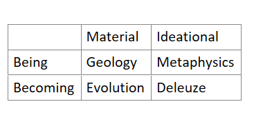

# Chapter 7: Material and Ideational

## 7.1 Introduction

The material/ideational debate addresses what ultimately drives social reality and social change: whether material conditions—economic relationships, technological capabilities, physical environments, resource distributions—provide foundations shaping how people think and what cultural forms emerge, or whether ideas, meanings, and cultural frameworks constitute social reality in ways irreducible to material factors. This debate connects to previous debates by examining the nature of both individual motivations and collective arrangements while introducing questions about consciousness, meaning, and relationships between physical conditions and interpretive frameworks (Marx, 1867/1990; Weber, 1922/1968; Archer, 1995, 1996).

Understanding this debate proves essential because positioning within it fundamentally shapes research design, explanation, and intervention strategies. Material-oriented approaches typically emphasize how economic structures, technological systems, and resource distributions constrain possibilities and generate systematic patterns, leading to interventions focused on redistributing resources and transforming institutional arrangements. Ideational-oriented approaches typically emphasize how meanings, interpretations, and cultural frameworks constitute what counts as resources and shape how people understand and respond to conditions, leading to interventions focused on changing beliefs, reframing situations, and transforming cultural systems (Sayer, 2000; Elder-Vass, 2010).

The material/ideational debate occupies the third level within the four-debate framework because it builds on individual-collective and structure-agency foundations while introducing distinctive questions about the nature of social reality itself. Positioning on individuals/groups and structure/agency typically shapes material-ideational commitments: those emphasizing collective properties and structural constraints often adopt materialist positions, while those emphasizing individual consciousness and agency often adopt ideational positions. However, the material/ideational debate adds crucial dimensions about what kinds of entities exist (physical versus meaningful), how they operate (through mechanisms versus interpretations), and whether one dimension proves more fundamental. Understanding hierarchical relationships between debates proves essential for recognizing how ontological commitments cohere or contradict across the framework (Bhaskar, 1979; Archer, 1995).

Contemporary research increasingly recognizes that adequate social explanation requires examining both material conditions and ideational frameworks while specifying how they interact. This has generated sophisticated middle-ground positions that attempt to recognize both material constraints and meaningful constitution while specifying how physical conditions and interpretive frameworks interact. These includes Max Weber's analysis of how economic structures and religious ideas interact to shape capitalist development, Pierre Bourdieu's concepts of different forms of capital showing how economic and cultural resources operate through distinct logics, and Margaret Archer's analytical dualism distinguishing material structures from cultural systems while analyzing their interaction through morphogenetic cycles. However, these integration approaches require careful analysis to distinguish genuine theoretical innovation from unresolved tensions that might undermine explanatory adequacy (Weber, 1922/1968; Bourdieu, 1986; Archer, 1995, 1996).

### 7.1.1 The Orthogonality of Material/Ideational and Structure/Agency

Before turning to the historical development of the material/ideational debate, it is necessary to clarify the difference between the material/ideational distinction and structure/agency distinction**,** as these can be easily confused with each other. They represent different analytical dimensions that cross-cut rather than reduce to each other, and confusion about their relationship generates substantial theoretical difficulties in contemporary social research (Archer, 1995, 1996; Elder-Vass, 2010).

The material/ideational distinction concerns the ontological nature of social phenomena—that is, what kind of “stuff” social reality is made of. It asks whether analysis focuses on material conditions such as physical arrangements, resource distributions, and technological systems, or on ideational elements such as meanings, interpretive frameworks, and symbolic systems. By contrast, the structure/agency distinction concerns the functional role entities play in social processes. It asks whether analysis focuses on relatively enduring arrangements that constrain and enable action (structures), or on the capacities of human actors for reflexive consciousness, strategic choice, and transformative action (agency).

Critically, *both* material and ideational entities can be either structural or agentic. For this reason, the material/ideational and structure/agency distinctions are best understood as orthogonal, meaning that they refer to independent analytical dimensions that intersect but cannot be reduced to one another. Material structures include property systems that are social-legal arrangements but material in their effects, for example economic relations organizing production and distribution, technological infrastructures enabling particular activities while foreclosing others, and resource distributions creating systematic advantages and constraints. These material structures constrain possibilities and enable actions through their physical and resource effects, operating as structural features of social reality whether or not any particular agent recognizes or accepts them (Marx, 1867/1990; Lawson, 1997). Material agency includes labor as embodied human action transforming physical environments, technological innovation creating new material possibilities, bodily practices through which agents operate in physical space, and strategic use of material resources to accomplish objectives (Bourdieu, 1977, 1990).

Ideational structures include cultural systems providing classificatory schemes, discursive formations organizing what can be thought and said, symbolic systems structuring meanings, and normative frameworks defining legitimate and illegitimate action. These ideational structures constrain interpretation and meaning-making through their systematic organization, operating as structural features that shape how actors understand possibilities even when actors are unconscious of these constraints (Saussure, 1916/1986; Foucault, 1969/2002; Archer, 1996). Ideational agency refers to how people make sense of situations, create new meanings with new interpretations, think strategically about their circumstances, and communicate to transform collective understandings (Weber, 1922/1968; Habermas, 1984).

Understanding this orthogonality is important for staying theoretically precise: conflating material/ideational with structure/agency generates theoretical confusion that undermines adequate social explanation. It also clarifies that material does NOT mean "only physical" or "naturally given." Material structures include recursive social arrangements like property systems and economic relations that exist through ongoing social reproduction but are material in their effects through constraining access to physical resources and organizing production. Property systems are not natural facts about physical objects but social-legal arrangements, yet they operate as material structures by organizing who can use what resources and under what conditions, generating material advantages and disadvantages independently of whether actors accept these arrangements as legitimate (Lawson, 1997; Sayer, 2000).

## 7.2 Historical Development of the Debate

The material/ideational debate has deep philosophical roots in ancient Greek tensions between materialist and idealist metaphysics, but gained distinctive form through Kant's critical philosophy establishing foundational distinctions between phenomena (how things appear to consciousness) and noumena (how they exist independently). Contemporary positions within this debate often reflect these deeper philosophical commitments about the relationship between mind-independent reality and consciousness (Kant, 1781/1998; Bhaskar, 1975, 1979). Readers may recall from Chapter 1 how the mechanistic, atomist ontology of the scientific revolution shaped early social inquiry; the materialist tradition examined below is in part the heir of that inheritance, just as the ideational tradition descends from the Kantian insistence that the mind actively structures experience.

### 7.2.1 Kantian Foundations: Phenomena and Noumena

As Chapter 1 established, Kant distinguished phenomena—things as they appear to us through our mental categories—from noumena—things existing out there independently of experience. While we can know phenomena with certainty because our minds actively structure experience according to necessary categories, noumena remain forever inaccessible because we cannot know things independently of the categories through which we must think them (Kant, 1781/1998; Allison, 2004).

This Kantian framework establishes philosophical foundations for the material/ideational debate in several crucial ways. It creates the problem of how mind-independent reality (material conditions as noumena) relates to consciousness and meaning (phenomena as things appear), raises questions about whether we can have knowledge of material conditions as they exist independently or remain confined to studying them as they appear through cultural categories, and generates tensions about whether material reality determines how things appear or whether interpretive frameworks constitute what we can know about material conditions. These philosophical questions shape concrete research choices about whether to emphasize material conditions as objective constraints or interpretive frameworks as constituting what material conditions mean (Guyer, 2006; Gardner, 1999).

### 7.2.2 Materialist Traditions

The materialist tradition developed through emphasizing how physical conditions and economic relationships provide foundations shaping ideational forms. Marx's historical materialism analyzed how economic base—the mode of production and property relations—determines institutional superstructure and shapes consciousness, with ideas reflecting material conditions rather than possessing autonomous causal efficacy (Marx, 1845/1998, 1859/1977). French structural Marxism, particularly Althusser's reading, radicalized this by analyzing how material structures reproduce themselves through ideological state apparatuses constituting subjects who recognize themselves within existing arrangements (Althusser, 1971). Analytical Marxism attempted providing micro-foundations by examining how material conditions generate rational incentives shaping individual choices that aggregate to reproduce material structures, using rational choice theory to explain how material constraints determine outcomes without requiring ideological mystification (Cohen, 1978; Roemer, 1982).

Beyond Marxism, materialist approaches developed through examining how technological systems shape social possibilities (technological determinism), how environmental conditions constrain development (ecological materialism), and how resource distributions generate systematic advantages independently of cultural meanings (Diamond, 1997; White, 1949; Lenski, 1966).

### 7.2.3 Ideational Traditions

The ideational tradition developed through emphasizing how meanings and symbolic systems constitute social reality rather than simply reflecting material conditions. Hegel's phenomenology analyzed how consciousness develops through dialectical processes where subjective spirit progressively recognizes itself in objective forms, treating ideas as active forces shaping history (Hegel, 1807/1977). Weber's interpretive sociology challenged materialist determinism by demonstrating how religious ideas could generate economic transformations independently of material interests, with Protestant ethics creating cultural frameworks enabling capitalist development rather than simply reflecting capitalist economic relations (Weber, 1905/2002).

Phenomenological sociology and social constructionism radicalized ideational commitments by analyzing how social reality is constituted through actors' interpretive practices and meaning-making activities (Schutz, 1932/1967; Berger and Luckmann, 1966). Symbolic interactionism extended this by analyzing how meanings emerge through interaction and how actors continuously negotiate definitions of situations rather than simply responding to material constraints (Blumer, 1969; Goffman, 1959, 1974). Cultural sociology, particularly through Alexander's strong program, emphasized cultural autonomy by examining how symbolic systems operate according to internal logics not reducible to material conditions or functional requirements (Alexander, 2003; Alexander and Smith, 2003).

### 7.2.4 Integration Attempts and Contemporary Developments

Integration attempts emerged recognizing that neither pure materialism nor pure ideationalism could adequately explain social phenomena exhibiting both material constraint and meaningful constitution. Bourdieu developed concepts of multiple capitals (economic, cultural, social, symbolic) operating through habitus and field to analyze how material and cultural advantages interact without reducing either to the other (Bourdieu, 1977, 1986). Archer's morphogenetic approach distinguished analytical cycles for cultural systems and material structures, examining how each develops through different temporal rhythms while interacting at specific conjunctures where cultural and material contradictions generate possibilities for transformation (Archer, 1995, 1996).

Contemporary developments reflect growing sophistication about emergence, mediation, and interaction. Critical realism provided ontological foundations by distinguishing stratified domains where both material structures and cultural systems exist as emergent properties with distinctive causal powers while interacting through complex mechanisms (Bhaskar, 1979; Archer, 1995, 1996). Practice theory emphasized how material and ideational dimensions exist through ongoing practices drawing upon both material resources and meaningful frameworks without reducing either to the other (Bourdieu, 1990; Schatzki, 2002; Ortner, 2006).

## 7.3 Ontological Dimensions of the Material/Ideational Debate

The material/ideational debate can be analyzed through four organizational dimensions revealing how ontological commitments manifest in research practice. One pole proves ontologically primary for understanding material conditions while the other pole proves ontologically primary for understanding ideational frameworks, creating symmetrical but opposite explanatory burdens.

### 7.3.1 Ontology/Epistemology Dimension: Mind-Independent vs. Meaningfully Constituted

#### 7.3.1.1 Understanding the Dimension’s Significance

The ontology/epistemology dimension addresses whether research maintains critical distinction between what exists independently (ontology) and our knowledge about what exists (epistemology), or whether it collapses into the epistemic fallacy. For the material/ideational debate, this dimension proves foundational because it determines whether material conditions exist mind-independently with causal powers operating regardless of consciousness, or whether they exist only as meaningfully constituted through interpretive processes.

#### 7.3.1.2 The Poles and Their Implications

The materialist realist pole takes as ontologically given that material conditions possess mind-independent existence operating through physical mechanisms and resource distributions that constrain possibilities regardless of how actors interpret them. From this perspective, economic structures shape class possibilities through mechanisms of capital accumulation and exploitation operating independently of whether actors understand these mechanisms; resource distributions create advantages and constraints that exist regardless of cultural meanings attached to resources; technological systems enable and constrain activities through physical properties that operate independently of symbolic interpretations. Mind-independence means these material conditions exist at a level of reality distinct from consciousness, exercising causal powers through physical and resource effects that operate whether or not these effects are recognized or accepted as legitimate (Marx, 1867/1990; Bhaskar, 1979; Lawson, 1997).

Crucially, mind-independent material conditions include not only naturally given physical facts but also recursive social arrangements like property systems and economic relations. Property systems are social-legal arrangements rather than natural features of physical objects, yet they operate mind-independently by constraining who can use what resources regardless of whether particular actors are aware of, understand and accept property claims as legitimate. When property systems exclude some actors from resource access while enabling others' control, these exclusions and enablements operate through institutionalized enforcement mechanisms that function regardless of excluded actors' consciousness and interpretations. Similarly, economic relations are socially organized rather than determined by physical technology, yet they operate mind-independently by structuring production possibilities and distributional outcomes through mechanisms that constrain possibilities regardless of how actors understand them. The mind-independence of material structures lies in their operating through physical and resource effects independently of consciousness, not in their being naturally given or independent of all social processes (Lawson, 1997; Sayer, 2000).

This positioning treats material realism as necessary for recognizing how constraint actually works, maintaining that structures must exist independently of consciousness to exercise genuine causal powers that cannot be eliminated through reinterpretation. Economic crises occur despite optimistic interpretations; resource scarcities limit possibilities regardless of cultural frameworks; technological constraints prevent activities despite innovative meanings. This position must therefore explain how material conditions that exist independently of beliefs are nevertheless understood by actors, without reducing interpretation to a passive mirror of material reality (Sayer, 2000; Collier, 1994).

The ideationalist pole takes as ontologically given that what appears as material constraint exists through being meaningfully constituted by interpretive frameworks, with effects operating through consciousness and meaning-making rather than through mind-independent physical mechanisms. From this perspective, material conditions constrain only insofar as actors interpret them as constraining; economic structures shape action only through actors' understandings of economic relationships; resource distributions matter only through cultural meanings attached to resources; technological systems enable and constrain only through interpretations of technological possibilities. Thus, material conditions exist as meaningful rather than as mind-independent: they are phenomena appearing through consciousness rather than noumena existing independently. What appears as objective material constraint reflects successful legitimation of particular interpretive frameworks rather than operation of mind-independent mechanisms.

This ideationalist position reflects ontological constructionism: the claim that we call "material conditions" are not mind-independent but are constituted through interpretive processes that make them socially operative. This is an ontological claim about mode of existence, not merely an epistemological claim about how we know material conditions (Berger and Luckmann, 1966; Searle, 1995). This positioning treats meaningful constitution as describing how material conditions ontologically exist in social life: not as mind-independent physical facts but as phenomena constituted through consciousness and maintained through ongoing interpretation. Material conditions constrain only when actors accept particular interpretations as legitimate: property systems exclude only when exclusions are recognized and enforced through collective beliefs about legitimacy; economic structures shape action only when actors orient themselves toward economic meanings; resource distributions matter only when resources are culturally valued.

This position must carefully explain: 1) how material constraints that appear to operate independently of actors' interpretations (economic crises despite optimism, resource scarcities despite reinterpretation, technological limitations despite innovation) can be adequately understood as meaningfully constituted rather than as mind-independent; 2) how does meaningful constitution generates systematic constraint without collapsing into voluntarism (Bhaskar, 1979; Searle, 1995).

#### 7.3.1.3 Key Positioning Examples

Analytical Marxism exemplifies materialist realism by explaining social phenomena through material mechanisms operating independently of ideological consciousness (Cohen, 1978; Roemer, 1982). Cohen's defense of historical materialism argues that productive forces develop according to material logic of increasing human productive capacity, with property relations and ideological superstructure explained through their functionality for productive force development. Economic structures possess objective properties—exploitation rates, profit rates, capital accumulation dynamics—that operate through physical mechanisms regardless of whether anyone understands these mechanisms or accepts their legitimacy.

Social constructionism exemplifies ideationalist positions, though we must be careful to distinguish between epistemological constructivism (claims about how we know) and ontological constructionism (claims about what exists). Berger and Luckmann's analysis examines how institutional arrangements exist as externalized products of human activity that become objectivated through habitualization and internalized through socialization, emphasizing that this objectivation depends on continued acceptance rather than reflecting mind-independent existence (Berger and Luckmann, 1966). What appears as material constraint—economic necessities, institutional requirements, technological limitations—reflects socially constructed definitions that could be otherwise if actors contested dominant interpretations. This represents ontological constructionism: the claim that apparent material constraints exist through meaningful constitution rather than mind-independent mechanisms.

#### 7.3.1.4 Ontologically Primary and Derivative Poles

The materialist realist pole proves ontologically primary for understanding material conditions because material arrangements necessarily possess mind-independent existence to exercise constraining effects operating regardless of interpretation. Material conditions that exist only as ideas or social constructions cannot exercise the systematic, persistent constraint that material analysis reveals. For materialist positions, mind-independent reality describes what material conditions ontologically are: physical arrangements and mechanisms operating according to principles existing whether or not adequately understood, constituting deeper reality underlying phenomenological appearance. However, this does not mean the ideationalist pole is impossible—it simply requires substantial theoretical work to show how meaningful constitution can generate systematic constraint without mind-independent mechanisms. Archer's cultural systems demonstrate one way this can work: cultural systems possess emergent properties (logical relationships, contradictions, implications) that exist mind-independently as features of cultural organization, showing how ideational frameworks can constrain without reducing to individual beliefs (Archer, 1996).

The ideationalist pole proves ontologically primary for understanding how material conditions operate through consciousness because material constraint necessarily works through actors' interpretations of what constrains them. Material conditions that actors do not recognize or accept as legitimate cannot constrain action in the ways pure materialist accounts suggest. For ideationalist positions, appearance and meaningful constitution describe how material conditions ontologically exist in social life: as meanings and interpretations constituted through ongoing social processes, with what appears as objective constraint reflecting successful legitimation of particular interpretive frameworks. However, this does not mean mind-independent material mechanisms are impossible— it simply requires substantial theoretical work to show how consciousness relates to mind-independent reality without reducing interpretation to mechanical reflection.

Moreover, this analysis must acknowledge an important complication: ideas themselves can exist mind-independently at the level of cultural systems, as Margaret Archer's work demonstrates. While individual beliefs and personal interpretations require consciousness and depend on particular minds for their existence, cultural systems—the logical organization of ideas, their relationships, and their internal contradictions—can exist as emergent properties at the cultural level that are mind-independent in the sense that they possess properties not reducible to what any particular mind believes (Archer, 1995, 1996). Logical relationships between propositions, contradictions within belief systems, and implications of theoretical frameworks exist as features of cultural systems that can be discovered rather than simply constructed. This means that the material/ideational debate involves asymmetry but not simple opposition: material conditions are primarily mind-independent, ideational meanings require interpretation for operation, but cultural systems at the ideational level can possess emergent properties that exist mind-independently as logical relationships and systemic features requiring analytical investigation to uncover.

### 7.3.2 Empirical Stratification Dimension: Object-Subject

#### 7.3.2.1 Understanding the Dimension’s Significance

The empirical stratification dimension addresses what can be observed empirically versus what requires stratified inference to access. Material conditions typically manifest as observable objects available for direct empirical documentation, while ideational frameworks require stratified investigation to access consciousness and meaning-making processes that cannot be directly observed. This asymmetry in empirical accessibility shapes methodological approaches: materialist research can rely heavily on direct observation and measurement, while ideational research must develop techniques for accessing unobservable meanings through observable manifestations (Bhaskar, 1979; Sayer, 2000).

#### 7.3.2.2 The Poles and Their Implications

The object pole takes as methodologically fundamental that material conditions present themselves as empirically observable objects directly documented without requiring stratified inference beyond the observable. Researchers can observe resource distributions, measure economic patterns, document technological systems at the empirical level where material objects present themselves directly. A researcher examining income distributions observes actual monetary values; a researcher documenting technological artifacts observes actual physical objects. Material conditions provide observable evidence that multiple researchers can examine independently: economic statistics can be verified, resource distributions can be measured, technological capabilities can be tested (Bhaskar, 1975; Danermark et al., 2002). But this raises a critical point: when we treat material conditions as independently observable facts, we overlook how observation itself involves theoretical frameworks and cultural categories.

The subject pole takes as methodologically necessary that ideational frameworks require stratified investigation to access consciousness, meanings, and interpretive processes that cannot be directly observed. Researchers cannot observe consciousness itself but must infer mental states from expressions and behaviors; cannot observe meanings directly but must interpret them from texts, practices, artifacts. When researchers examine consciousness, they observe words providing evidence for thoughts; when they investigate meanings, they observe behaviors expressing interpretations. The investigation requires stratification: distinguishing what can be directly observed from what these observations provide evidence for at an unobservable level requiring inference (Danermark et al., 2002; Schwandt, 2000). This positioning faces the explanatory burden of showing how inferences from observable expressions to unobservable consciousness can be validated and how stratified investigation can achieve reliability despite requiring inference beyond direct observation.

#### 7.3.2.3 Key Positioning Examples

Quantitative economics exemplifies the object pole by documenting material conditions through systematic observation and measurement of economic objects available for direct empirical investigation (Samuelson, 1947). Economic research measures GDP through aggregating observable production, documents inequality through recording observable income distributions, analyzes markets through tracking observable prices and quantities. While acknowledging that actors have subjective preferences, quantitative economics treats these as manifesting in observable behaviors documented without directly accessing consciousness.

When interpretive sociologists observe people exchanging money for goods, they must infer whether actors understand exchange as commercial transaction, gift-giving, or ritual offering. The investigation requires stratification: researchers observe behaviors but must infer consciousness and meanings that cannot be directly observed (Schutz, 1932/1967; Weber, 1922/1968).

#### 7.3.2.4 Ontologically Primary and Derivative Poles

The object pole is ontologically primary because material conditions present themselves as directly observable phenomena. Physical objects can be measured, resource distributions recorded, technological capabilities tested—all without requiring stratified inference to access hidden meanings or consciousness. For materialist positions, this direct observability is what defines material conditions: phenomena accessible to multiple researchers independently (Bhaskar, 1975; Sayer, 2000).

However, material conditions can also be investigated through stratification when research examines social material structures operating beyond direct observation. Property systems, economic relations, and technological infrastructures exist as stratified social arrangements: while their effects manifest observably, understanding these structures requires inferring organizational mechanisms from observable patterns. When researchers examine income distributions, they observe monetary values but must infer economic structures organizing production and distribution through mechanisms not directly observable. When researchers document technological systems, they observe physical artifacts but must infer the stratified social organization determining how technologies get developed and deployed. This stratified material investigation requires substantial theoretical work showing how observable patterns provide evidence for unobservable structural mechanisms. Without such theoretical specification, stratified material analysis risks imposing theoretical constructions lacking empirical warrant (Lawson, 1997; Archer, 1995).

The subject pole is ontologically primary because ideational phenomena—meanings, consciousness, cultural systems—cannot be observed directly. Researchers must infer them from observable evidence: expressions, behaviors, artifacts, self-reports. Unlike material conditions that can be directly measured, ideational frameworks require stratified inference, accessible only through their manifestations (Schutz, 1932/1967; Archer, 1996).

However, ideational frameworks can also be treated empirically when research documents observable expressions, texts, and practices without inferring unobservable consciousness or meanings. Content analysis can count word frequencies in texts, discourse analysis can identify patterns in speech, behavioral observation can document regularities in action—all without claiming access to unobservable meanings or consciousness. This empirical ideational investigation requires substantial theoretical work showing how observable patterns can be documented without stratified inference to unobservable mental states, and whether such documentation captures what is significant about ideational frameworks or merely records surface manifestations divorced from meanings. Without such theoretical specification, empirical ideational analysis risks reducing meanings to observable behaviors while missing the interpretive processes that make expressions meaningful. The ideational pole is naturally stratified requiring inference to consciousness, but treating ideational phenomena empirically through documenting observable expressions requires theoretical justification for why surface patterns matter independently of unobservable meanings (Schwandt, 2000; Alexander, 2003).

### 7.3.3 Time/Space Dimension: Being-Becoming

#### 7.3.3.1 Understanding the Dimension’s Significance

The time/space dimension addresses how material conditions and ideational meanings exist and operate through temporal processes and spatial relationships, drawing on philosophy's fundamental opposition between Being (unchanging permanence) and Becoming (continuous flux). Parmenides emphasized Being as static reality existing timelessly, while Heraclitus emphasized Becoming as continuous transformation without stable essence (Kirk et al., 1983; Barnes, 1982). This framework reveals crucial asymmetry: material conditions CAN exist through pure Being (physical properties persist without interpretation) but CANNOT dissolve into pure Becoming (matter always maintains stable properties). Ideational meanings CANNOT exist through pure Being (meanings require interpretation to function) but CAN exist through pure Becoming (interpretive flux without fixed structures). This asymmetry shapes how each dimension operates temporally.

Understanding this dimension requires recognizing that we are examining a single continuum from pure Being through various middle positions to pure Becoming, with material and ideational approaching from opposite directions. Material positions begin from pure Being and move toward integration with Becoming through structuration; ideational positions begin from pure Becoming and move toward integration with Being through semiosis (i.e. the process of signification in language). The middle range where structuration meets semiosis represents sophisticated integration attempts, not a single position but a range of approaches that balance Being and Becoming through different theoretical mechanisms.

#### 7.3.3.2 The Material Spectrum: Being Through Structuration

At the Being pole, crude materialism treats material structures as simply existing with permanent properties determining social arrangements mechanically. Simple base-superstructure models, technological determinism, and ecological determinism all assume material structures exist timelessly through physical properties rather than requiring social reproduction (mechanical materialism). Economic structures exist as permanent fixtures; technological capabilities determine possibilities mechanically; environmental conditions constrain development automatically. This positioning faces obvious explanatory burdens: How does transformation occur if structures exist permanently? How do practices affect conditions if properties determine outcomes mechanically? Pure Being materialism cannot explain social change or human agency's role in transforming material conditions (Bhaskar, 1979).

Moving from pure Being toward integration with Becoming, the middle structuration range recognizes material structures possess relative permanence (Being aspects) but require ongoing reproduction through practices (Becoming aspects), creating Being-through-Becoming where structures endure by being continuously re-enacted. This range itself forms a spectrum of positions that differ in how much emphasis they place on structural permanence versus transformative processes. Being-emphasized structuration (classical political economy, structural Marxism) emphasizes structural stability and long-term persistence of material arrangements while acknowledging that reproduction requires ongoing practices. These approaches treat material structures as possessing substantial inertia and resistance to transformation, with practices primarily reproducing rather than transforming existing arrangements. Structural change occurs through accumulating contradictions within material structures themselves rather than through practices directly transforming structures (Althusser, 1971; Cohen, 1978).

Balanced structuration occupies the middle of this range, giving equal weight to structural properties and reproductive practices. Giddens' recursive instantiation examines how structures exist only through being instantiated in practices while practices necessarily draw upon structural rules and resources (Giddens, 1984). Archer's morphogenetic cycles distinguish temporal phases where structures temporally precede and constrain action, action occurs within inherited structural contexts, and accumulated action either reproduces or transforms structures (Archer, 1995). Bourdieu's habitus-field dynamic shows how material conditions become internalized as dispositions generating practices that tend to reproduce field structures while allowing strategic innovation (Bourdieu, 1990). These balanced approaches recognize both structural constraint (Being) and transformative potential (Becoming) without privileging either.

Becoming-emphasized structuration gives greater weight to transformative potential and contingency of reproduction while still acknowledging structural constraints operate. Neo-Gramscian hegemony theory examines how material structures persist only through ongoing political struggle maintaining particular alignments of forces, with hegemony requiring continuous reproduction through ideological work and coercive capacity (Gramsci, 1971). Regulation theory analyzes how capitalist accumulation requires institutional forms of regulation that are historically specific and subject to crisis and transformation, emphasizing contingency of material reproduction (Boyer, 1990). These approaches treat material structures as requiring active reproduction that is never guaranteed, with transformation always possible through shifts in practices, struggles, or regulatory frameworks.

It is crucial to recognize that no pure Becoming pole exists for material because physical reality cannot dissolve into pure flux—matter always maintains properties (mass, energy, composition) constraining transformation possibilities. A boulder may be reshaped through geological or human processes but cannot become liquid through social interpretation alone; technologies may be used creatively but physical properties constrain what uses are possible; economic structures may be transformed but material scarcity creates constraints that persist despite cultural reinterpretation. The impossibility of pure Becoming for material reflects physical properties' mind-independence: material conditions possess stable characteristics that constrain transformation regardless of how actors interpret them.

#### 7.3.3.3 The Ideational Spectrum: Semiosis Through Becoming

At the opposite end of the continuum, no Being pole exists for ideational because meanings cannot exist as static contents independent of interpretation and consciousness. Meanings require interpretive processes to function meaningfully—a text unread ceases to operate as meaning even if physical marks persist; a cultural code unused loses its capacity to organize interpretation; a symbol uninterpreted becomes merely physical mark rather than meaningful sign. While Archer demonstrates cultural systems possess emergent logical properties existing mind-independently as relationships between propositions, these logical properties operate meaningfully only through potential interpretation (Archer, 1996). The impossibility of pure Being for ideational reflects meanings' dependence on consciousness: ideational frameworks cannot constrain interpretation without being interpreted.

Moving from middle positions toward pure Becoming, the semiosis range treats meanings as continuously emerging through interpretation (Becoming) within structural constraints provided by codes, conventions, and cultural systems (Being elements). This range forms a spectrum differing in emphasis on structural stability versus interpretive flux. Being-emphasized semiosis (Saussure's structural linguistics, Lévi-Strauss' structural anthropology) emphasizes synchronic stability of sign systems and systematic structure of meaning while acknowledging interpretation occurs. These approaches examine how linguistic structures constrain meaning through systematic relationships among signs, how cultural codes organize classification through stable oppositions, how symbolic systems provide frameworks that persist across individual variations in interpretation. Meanings change slowly through systematic transformations of entire structures rather than through individual interpretive innovation (Saussure, 1916/1986; Lévi-Strauss, 1963).

Balanced semiosis encompasses multiple positions giving equal weight to structural constraints and interpretive processes through different theoretical apparatus. Peirce's pragmatist semiotics analyzes unlimited semiosis where signs generate further interpretations without final signified, but this unlimited play is constrained by objects (what signs refer to) and habits (interpretive regularities developed through practice) (Peirce, CP 2.228). Gadamer's hermeneutics examines fusion of horizons where interpretation involves bringing one's own historical horizon into dialogue with texts' historical horizons, with tradition providing structural constraints while understanding requires creative interpretive engagement (Gadamer, 1960/1989). Berger and Luckmann's institutionalization cycles show how meanings become sedimented through habitualization and objectivated through institutionalization, but require ongoing reproduction through socialization and legitimation (Berger and Luckmann, 1966). Phenomenology analyzes intentional structures enabling meaning-constitution: consciousness necessarily involves intentionality (directedness toward objects), with intentional structures constraining what meanings are possible while interpretation generates meanings through active constitution (Schutz, 1932/1967).

These balanced approaches recognize both Being aspects (structural constraints, codes, traditions, intentional structures) and Becoming aspects (unlimited semiosis, interpretive engagement, institutionalization processes, active constitution) without reducing either to the other. The structural constraints are not mechanical determinants but frameworks enabling meaning while limiting possibilities; the interpretive processes are not arbitrary but work within and through structural frameworks while generating novel meanings.

Becoming-emphasized semiosis gives greater weight to continuous transformation and contingency while acknowledging structural constraints operate. Foucault's discursive formations examine how statements organize fields of discourse through rules governing what can be meaningfully said, but emphasize discontinuous transformations where entire discursive formations shift through ruptures rather than continuous evolution (Foucault, 1969/2002). Pragmatism treats meanings as emerging through practical engagement with problematic situations, emphasizing experimental reconstruction of meanings and rejection of fixed essences (Dewey, 1938). These approaches recognize structural constraints but emphasize how transformation occurs through shifts in practices, ruptures in discourse, or experimental reconstruction.

The Becoming pole represents pure interpretive flux without stable structures. Derrida's différance analyzes meanings as never present, always deferred through unlimited play of signification without final signified or transcendent structure stabilizing meaning (Derrida, 1967/1976). Deleuze's philosophy of becoming-without-being treats reality itself as pure immanent flux without transcendent structures, with repetition producing difference rather than sameness and meanings continuously transforming without stable identity (Deleuze, 1968/1994). These positions eliminate Being-aspects altogether, representing the ideational pole because meanings can dissolve into pure flux in ways material reality cannot. The possibility of pure Becoming for ideational reflects meanings' dependence on interpretation: without structural constraints from codes or objects, interpretation generates endless deferral and transformation.

#### 7.3.3.4 Middle as Range, Not Point

Understanding Being-Becoming requires recognizing "middle positions" represent *ranges*, not single points. The middle range where material structuration meets ideational semiosis contains multiple sophisticated positions differing in:

1)  degree of emphasis on Being versus Becoming—whether emphasizing structural permanence or transformative processes;

2)  integration mechanism—how they theorize Being-Becoming relationships (recursive instantiation, temporal cycles, dialectical internalization, triadic semiotics, hermeneutic circles, institutionalization processes);

3)  theoretical apparatus—what concepts and analytical tools they employ for specifying integration;

4)  whether they address material or ideational, with material approaches emphasizing structuration (Being-through-Becoming) and ideational approaches emphasizing semiosis (Becoming-through-Being).

Giddens, Archer, and Bourdieu all occupy balanced structuration but use fundamentally different integration mechanisms and theoretical resources. Giddens emphasizes recursive instantiation where structures exist only through practices while practices draw upon structures (Giddens, 1984). Archer emphasizes temporal cycles distinguishing phases where structures precede action, action occurs within constraints, and outcomes reproduce or transform structures (Archer, 1995). Bourdieu emphasizes dialectical internalization where material conditions become embodied as habitus generating practices within fields (Bourdieu, 1990). Despite occupying similar positions on the Being-Becoming continuum, these approaches employ different theoretical apparatus for explaining how Being and Becoming integrate.

Similarly, Peirce, Gadamer, and phenomenology all occupy balanced semiosis but employ different theoretical apparatus. Peirce uses triadic semiotics with signs, objects, and interpretants; Gadamer uses hermeneutic circles with horizons and fusion; phenomenology uses intentional structures and noetic-noematic correlation. These different theoretical frameworks provide distinct resources for analyzing how structural constraints (Being) and interpretive processes (Becoming) interact to generate meanings (Peirce, CP 2.228; Gadamer, 1960/1989; Schutz, 1932/1967).

Recognizing middle-as-range prevents treating all integration attempts as equivalent, enables recognition that positions at different points have different explanatory strengths, and clarifies that sophistication consists in explicit theoretical development rather than particular positioning. The asymmetry between spectra reflects fundamental ontological differences: physical objects possess consciousness-independent properties constraining transformation; meanings possess no such properties, enabling pure Becoming as ontological possibility for ideational but not material. However, sophistication typically requires middle-range positions integrating Being and Becoming rather than polar emphasis on one while eliminating the other.

#### 7.3.3.5 Ontologically Primary and Derivative Poles

The Being pole proves ontologically primary for material structures because physical properties can persist without requiring continuous reproduction or interpretation. Material objects maintain mass, energy, and composition; physical properties constrain what transformations are possible; technologies possess capabilities that persist whether used or not. Social material structures typically require ongoing reproduction through legal enforcement and institutional maintenance, but physical properties themselves provide stability enabling structures to constrain even when reproduction temporarily lapses. For materialist positions, Being describes material persistence—the tendency of physical properties to remain stable providing foundation for material structures. The derivative theoretical burden for ideational positions involves explaining how meanings can generate systematic constraint without stable Being—how pure Becoming can produce regularities and persistent patterns rather than arbitrary flux. This explains why sophisticated ideational positions typically occupy semiosis range rather than pure Becoming: without some Being aspects (codes, conventions, intentional structures), meanings dissolve into arbitrary interpretation.

The Becoming pole proves ontologically primary for ideational meanings because meanings necessarily require interpretation and consciousness to function meaningfully. Cultural codes constrain interpretation only through being used; linguistic structures organize meaning only through speakers employing them; symbolic systems structure understanding only through interpreters engaging them. While cultural systems may possess emergent logical properties as Archer demonstrates, these operate meaningfully only through interpretive engagement making them relevant for meaning-making. For ideational positions, Becoming describes necessary meaning-constitution—the requirement that meanings continuously emerge through interpretation rather than existing as stable contents. The derivative theoretical burden for materialist positions involves explaining how material structures can transform and require reproduction without dissolving into flux—how Becoming can occur within material constraints without eliminating stable properties. This explains why sophisticated materialist positions typically occupy structuration range rather than pure Being: without Becoming aspects (reproduction through practices, transformation through contradictions), material structures become mechanical determinants incapable of change.

However, recognizing these ontological primacies does not validate crude materialism's Being or pure flux's Becoming. Most adequate explanation requires middle-range positions integrating Being and Becoming through sophisticated theoretical specification of how stability and transformation, structure and process, constraint and innovation interact. The continuum from pure Being through structuration and semiosis to pure Becoming represents logical possibilities, but sophisticated research typically occupies middle ranges where integration mechanisms specify how both dimensions operate.

### 7.3.4 Causality Dimension: Physical-Interactive

#### 7.3.4.1 Understanding the Dimension’s Significance

The causality dimension addresses what kinds of causal powers material conditions and ideational frameworks possess: whether material conditions produce effects through physical mechanisms operating independently of interpretive processes, or whether ideational meanings cause effects through interactive processes where outcomes depend on interpretation and meaning-making. This dimension examines how causation operates—through what mechanisms material conditions and ideational meanings generate outcomes and influence social life—building on the time/space dimension's examination of how material and ideational exist through temporal processes (structuration and semiosis) (Bhaskar, 1979; Sayer, 2000).

#### 7.3.4.2 The Poles and Their Implications

Physical causation takes as ontologically given that material conditions possess causal powers operating through physical mechanisms generating effects independently of whether actors understand these mechanisms or accept their operation. Material constraints limit possibilities through physical scarcity: lacking food prevents survival regardless of optimistic interpretations about abundance; lacking shelter exposes bodies to elements regardless of cultural narratives about self-sufficiency; lacking tools prevents production regardless of innovative meanings attached to manual labor. Economic structures shape class possibilities through mechanisms of exploitation and accumulation: surplus extraction occurs through controlling productive assets whether or not exploited actors recognize exploitation; capital accumulation generates crisis tendencies through falling profit rates operating independently of ideological justifications; competitive dynamics eliminate inefficient producers through market mechanisms regardless of entrepreneurs' subjective beliefs. Technological systems enable or constrain action through material capabilities: machines with particular specifications enable certain production processes while making others physically impossible; transportation infrastructure enables movement at particular speeds and distances determined by physical properties; communication technologies transmit information according to physical principles governing electromagnetic radiation or digital encoding. Environmental conditions affect social development through resource availability: fertile soil enables agricultural surplus supporting population growth; mineral deposits enable industrial development; water sources determine settlement patterns. The causal operation is physical in that material mechanisms generate effects through direct physical impact: lack of resources prevents action regardless of optimistic interpretations; economic crises occur through material contradictions despite ideological denials; technological limitations constrain possibilities independently of cultural narratives; environmental degradation creates physical conditions affecting health and survival whether or not culturally recognized (Bhaskar, 1975; Sayer, 2000).

However, physical causation is not limited to simple mechanistic impacts. Material causation operates through multiple mechanisms exhibiting different levels of complexity. At the simplest level, mechanistic physical causation involves direct transmission of forces: objects fall due to gravity, materials resist stress up to breaking points, energy transfers generate heat. This represents straightforward physics where causal effects follow from physical properties and forces. Biological material causation involves life processes: organisms require nutrients and oxygen, reproductive capacities determine population dynamics, disease transmission follows epidemiological patterns. While more complex than simple physics, biological causation still operates through material mechanisms—chemical processes, cellular organization, physiological systems—generating effects independently of interpretation.

Social material causation operates through institutional arrangements and resource distributions requiring social organization but generating effects through material mechanisms. Property systems constrain resource access through legal enforcement and institutional recognition, but once established they generate material advantages and disadvantages: owners can use resources for production or consumption, non-owners cannot access resources regardless of need or desire. This causation is social in requiring institutional arrangements, but material in operating through physical access to resources. Economic relations organize production and distribution through class structures and market mechanisms that are socially organized but generate material effects: exploitation occurs through appropriating surplus product, accumulation requires reinvesting profits in expanded production, competition eliminates producers who cannot match efficiency standards. These economic mechanisms require social organization and cannot be reduced to simple physics, but they generate effects through material transformations and resource distributions rather than through meanings alone (Marx, 1867/1990; Lawson, 1997).

Most complex is recursive material causation where social arrangements reproduce themselves through practices that generate material effects reinforcing the arrangements. Educational institutions credential students through examinations and degrees (social practices), but these credentials then affect employment opportunities and income (material effects) in ways that reinforce educational stratification. Financial institutions create money through lending practices (social conventions), but this money creation affects real economic activity and resource distributions (material effects) that influence subsequent financial practices. Property systems allocate rights through legal recognition (social institutions), but these allocations then determine who can transform physical environments and accumulate resources (material effects) that shape future property distributions. This recursive causation exhibits the Being-through-Becoming character examined in the time/space dimension: material structures persist through ongoing reproduction (Becoming) while maintaining stable effects (Being), with practices generating material outcomes that reinforce structures even as they potentially transform them (Giddens, 1984; Bourdieu, 1990).

Material causation operates through possessed powers that structures have by virtue of their material properties—tendencies to generate effects under particular conditions—that are exercised through specific mechanisms when enabling conditions are present but exist as capacities even when not currently activated. Economic structures possess powers to generate exploitation and crisis tendencies whether or not these powers are currently manifesting in observable effects. Technological systems possess capacities to enable production whether or not currently being used. Resource distributions possess powers to constrain possibilities whether or not constraints are currently binding. Understanding material causation requires examining both possessed powers (what material structures are capable of producing by virtue of their properties) and exercised powers (when and how these capacities generate actual effects under specific conditions) (Bhaskar, 1975; Sayer, 2000).

This positioning treats physical causation as describing how material conditions actually operate to generate effects, maintaining that material mechanisms must possess physical causal powers to explain persistent patterns and systematic constraints operating despite ideological resistance. Material scarcity constrains through physical unavailability that no reinterpretation can overcome; economic exploitation operates through mechanisms of surplus extraction that persist despite ideological justifications; technological systems enable through material capabilities that exist independently of cultural meanings attached to technologies. While acknowledging that understanding material causation requires interpretation and that material effects always operate through social arrangements rather than as pure physical forces, physical causation positions insist that material mechanisms possess causal powers not reducible to meanings or interpretations. This positioning faces the explanatory burden of showing how physical causation operates through social arrangements without becoming mechanical determinism, explaining how material constraints that operate physically allow for human agency and strategic response rather than determining outcomes mechanistically, and addressing whether treating causation as physical obscures how material effects always emerge and operate through meaningful practices and institutional arrangements rather than as brute physical forces.

Interactive causation takes as ontologically given that ideational meanings possess causal powers operating through interactive processes where meanings shape how actors interpret situations and orient action accordingly. Meanings cause effects not through physical mechanisms but through constituting what situations mean and what responses appear appropriate. Cultural frameworks shape action by organizing perception and evaluation: what appears threatening versus safe, valuable versus worthless, legitimate versus transgressive depends on cultural meanings actors bring to situations. Interpretations cause effects by defining what goals are worth pursuing: actors orient action toward objectives that appear meaningful within interpretive frameworks rather than pursuing goals mechanically determined by physical conditions. Collective representations generate outcomes by establishing what behaviors are legitimate or transgressive: actors conform to normative expectations or face social sanctions that operate through collective judgments about appropriateness rather than through physical force. Symbolic systems constitute identities and group memberships: who counts as "us" versus "them," what characteristics define group boundaries, what obligations flow from membership all depend on symbolic classifications rather than physical properties. The causal operation is interactive in that meanings generate effects through processes where actors interpret situations, orient themselves toward understood goals, and act according to perceived appropriateness rather than through direct physical compulsion. Meanings cause by making particular interpretations plausible (certain ways of understanding situations seem natural rather than arbitrary), certain behaviors feel natural (acting according to cultural scripts requires no conscious deliberation), specific goals appear valuable (pursuing culturally validated objectives seems obviously worthwhile)—working through consciousness and communication rather than through physical force (Blumer, 1969; Goffman, 1974; Alexander, 2003).

This positioning treats interactive causation as describing how meanings actually operate to generate effects, maintaining that ideational causation works through interactive meaning-making rather than through physical mechanisms. Cultural meanings shape behavior by constituting what actions mean: the same physical behavior (handing over money) means different things (commercial transaction, gift-giving, tribute payment) depending on cultural frameworks that determine social significance. Symbolic systems generate effects by providing frameworks for interpretation: actors orient themselves within symbolic frameworks that make particular identities available and particular roles meaningful. Ideologies cause outcomes by establishing what arrangements appear natural or legitimate: existing distributions of power and resources seem inevitable or just when ideological frameworks successfully naturalize them. While acknowledging that meanings operate within material constraints and that ideational effects often involve material resources for their transmission (texts require physical media, cultural transmission requires embodied actors), interactive causation insists that meanings possess causal powers not reducible to material mechanisms. This positioning faces the explanatory burden of showing how interactive causation generates systematic effects rather than arbitrary variation (how meanings produce regularities rather than random interpretations), explaining how meanings that operate through interpretation constrain action without becoming mechanical determination of a different kind (how cultural frameworks limit possibilities without eliminating agency), and addressing whether treating causation as interactive obscures material constraints operating independently of interpretation.

#### 7.3.4.3 Key Positioning Example

W.I. Thomas’ interpretive sociology exemplifies interactive causation through the famous theorem that "if men define situations as real, they are real in their consequences" (Thomas and Thomas, 1928). This theorem captures how meanings cause effects through interactive interpretation rather than through physical mechanisms: when actors define situations as threatening, they respond with defensive actions generating consequences (conflict, withdrawal, mobilization) regardless of whether situations are objectively threatening according to external criteria; when actors define opportunities as available, they pursue goals generating outcomes (investment, education, migration) regardless of whether opportunities objectively exist according to material measures; when actors define groups as inferior or superior, they interact according to these definitions generating patterns of discrimination or deference regardless of actual group characteristics. Meanings cause effects not through physical mechanisms but through constituting how actors understand situations and orient action accordingly. The causal power operates through interpretation making particular responses seem appropriate rather than through material conditions mechanically determining behavior.

#### 7.3.4.4 Ontologically Primary and Derivative Poles

The physical causation pole proves ontologically primary for understanding how material conditions cause effects because material mechanisms necessarily possess physical causal powers to generate systematic constraints and enablements operating independently of interpretation. Material conditions without physical causal powers could not constrain possibilities, resist transformation, or generate persistent patterns—they would be purely ideal constructions without real effects. Physical causation describes what material mechanisms ontologically are for causal analysis: arrangements possessing causal powers by virtue of their physical properties generating effects through material mechanisms (resource constraints, technological capabilities, environmental conditions, recursive institutional effects) rather than through meanings or interpretations. For positions emphasizing material determination, physical causation explains persistent patterns and systematic constraints resisting ideological transformation: economic crises occur through material contradictions not eliminated by optimistic interpretations, resource scarcities constrain possibilities regardless of cultural reframings, technological limitations prevent actions despite innovative meanings. The derivative theoretical burden for ideational positions involves explaining how meanings can generate systematic effects without physical mechanisms—how interactive causation produces regularities and persistent patterns rather than arbitrary variation reflecting individual interpretive differences. Without substantial theoretical specification showing how meanings constrain systematically, positions emphasizing interactive causation risk collapsing into voluntarism where interpretation generates any outcome through reframing situations.

The interactive causation pole proves ontologically primary for understanding how ideational meanings cause effects because meanings necessarily operate through interactive processes where interpretation mediates causal influence. Meanings without interpretive mediation cannot cause effects—they remain potential rather than actual influences until actors interpret situations through meaningful frameworks and orient action accordingly. Interactive causation describes what ideational mechanisms ontologically are for causal analysis: frameworks possessing causal powers by virtue of constituting meaning generating effects through interactive interpretation (cultural frameworks organizing perception, symbolic systems structuring identities, normative expectations shaping behavior) rather than through physical mechanisms operating independently of consciousness. For positions emphasizing ideational constitution, interactive causation explains how meanings generate systematic effects without physical force: cultural frameworks constrain interpretation by making particular understandings plausible while others seem implausible, symbolic systems shape behavior by constituting what actions mean socially, normative expectations cause conformity through making transgression costly in terms of social sanctions rather than physical punishment. The derivative theoretical burden for materialist positions involves explaining how physical mechanisms can allow for interpretive variation and agency rather than determining outcomes mechanistically—how material constraints leave room for different cultural frameworks organizing responses to similar material conditions, how physical causation operates through social arrangements requiring meaningful constitution rather than as brute physical forces. Without substantial theoretical specification showing how physical causation allows agency, positions emphasizing physical mechanisms risk collapsing into mechanical determinism where material conditions eliminate interpretive freedom.

However, recognizing that material conditions cause through physical mechanisms while ideational meanings cause through interaction does not automatically validate either mechanical materialism eliminating interpretive freedom or idealist voluntarism eliminating material constraints. Most adequate explanation requires integration strategies recognizing both physical constraints and interactive meaning-making without reducing either to mechanical determination or unconstrained interpretation. The challenge lies in developing causal frameworks specifying how physical mechanisms and interactive processes interact: how material constraints operate through practices requiring meaningful interpretation, how meanings constrain systematically within material limits, how physical and interactive causation combine in generating outcomes that reflect both material possibilities and cultural frameworks.

## 7.4 Comparing Integration Strategies

Contemporary research increasingly recognizes that adequate explanation requires examining both material conditions and ideational frameworks while specifying how they interact causally and temporally. Three prominent integration frameworks reveal different strategies: Weber's elective affinity, Bourdieu's multiple capitals, and Archer's morphogenetic approach.

Weber's approach achieves integration showing how ideas and material interests align without either determining the other (Weber, 1905/2002). Religious ideas—Calvinist doctrines of predestination, ascetic vocational ethics, systematic rational conduct—generated cultural orientations toward rational accumulation conducive to capitalist development, but only because these religious ideas found affinity with emerging material interests of bourgeois classes seeking cultural legitimation for economic activity and rational justification for worldly success. Ideas possess causal efficacy through alignment with material conditions that make particular ideas practically significant: Calvinist ethics became influential not simply through theological coherence but through resonating with material situations of emerging capitalist classes. Material interests gain historically specific form through cultural frameworks defining appropriate economic action: profit-seeking became legitimate vocational calling rather than vice, accumulation became ascetic duty rather than greed, rational economic calculation became moral obligation rather than soulless materialism. The integration strategy here is mutual causation through alignment: neither material nor ideational possesses unilateral causal priority—both operate together through elective affinities where ideas that resonate with material interests become culturally powerful while material interests pursued through cultural frameworks gain particular historically specific forms.

Bourdieu's framework achieves integration through multiple capitals and habitus operating within fields (Bourdieu, 1977, 1986, 1990). Economic capital provides material resources (money, property, means of production) while cultural capital provides symbolic resources (credentials, cultural knowledge, aesthetic dispositions), with both operating through habitus within fields structured by distributions of these capitals. Economic and cultural capitals are not reducible to each other—cultural knowledge cannot be purchased directly, economic resources do not automatically generate cultural sophistication—but convert into each other under specific conditions through processes requiring time and effort: economic capital enables acquisition of cultural capital through purchasing education and cultural exposure, while cultural capital enables acquisition of economic capital through providing credentials opening employment opportunities and cultural knowledge facilitating advantageous connections. Economic and cultural capitals combine in generating social advantages that neither produces alone: elite reproduction requires both material resources funding educational advantages and cultural capital teaching children how to navigate elite institutions effectively. Habitus incorporates both material and cultural dimensions: dispositions shaped by material conditions of existence (economic security enabling long-term planning, material scarcity generating instrumental orientations) while operating through cultural schemes (aesthetic judgments, classificatory frameworks, behavioral styles). Fields involve both resource distributions (economic positions, institutional positions, control over material means) and symbolic struggles (competitions for recognition, contests over legitimate culture, battles for definitional authority). The integration strategy here is mutual constitution through practice: material and cultural capitals combine in generating advantages through habitus practices within fields, with neither capital reducible to the other but both operating together through practical dispositions that are simultaneously materially constrained and culturally structured.

Archer's morphogenetic approach achieves integration through analytical separation combined with temporal analysis of how separated dimensions interact through cycles (Archer, 1995, 1996). Rather than treating material and cultural as unified in practice or as converting into each other, Archer distinguishes morphogenetic cycles for structural elaboration (material) and cultural elaboration (cultural), examining how each develops through different temporal rhythms while interacting at specific conjunctures. Material structures develop through longer cycles than individual lives—property systems persist across generations, economic relations reproduce through institutional mechanisms, technological infrastructures require decades to transform—and possess emergent properties not reducible to cultural meanings: resource distributions constrain possibilities regardless of how they are interpreted, productive capacities enable activities independently of cultural frameworks, material contradictions generate crisis tendencies despite ideological denials. Cultural systems develop through logical relationships and contradictions not reducible to material determination: incompatible beliefs create logical tensions requiring resolution, contradictory values generate normative conflicts, inconsistent theories produce intellectual problems—all operating according to cultural logic rather than material causation. Archer's integration examines how material and cultural contradictions create possibilities for transformation: when material contradictions (economic crisis, resource depletion, technological disruption) align with cultural contradictions (incompatible beliefs, contested values, theoretical incoherence), opportunities emerge for systematic transformation of both dimensions as actors strategically employ cultural resources to address material problems or mobilize material resources to resolve cultural tensions. The integration strategy here is analytical dualism with causal interaction: material and cultural are separated analytically to reveal their different properties and developmental logics, then their interaction is examined through analyzing how contradictions in one domain create possibilities for transformation in the other, with neither domain determining the other but both interacting at conjunctures where their developmental cycles intersect.

These frameworks reveal fundamentally different integration strategies reflecting different ontological commitments about material-ideational relationships. Weber's elective affinity eliminates determination in either direction through emphasizing alignment and mutual causation: ideas and interests must align for either to be effective, but alignment is contingent rather than necessary, creating historical specificity where particular combinations of ideas and interests generate particular outcomes without universal laws determining which combinations will occur. Bourdieu's multiple capitals approach maintains distinction between economic and cultural while showing their practical unity through habitus and field: capitals remain analytically distinct with different properties and conversion mechanisms, but operate together through practices that simultaneously mobilize both material resources and cultural frameworks without reducing either to the other. Archer's morphogenetic analysis maintains analytical separation to reveal different properties while examining interaction through conjunctural analysis: material and cultural develop through distinct logics and temporal rhythms, but interact at specific historical moments where their contradictions align creating possibilities for coordinated transformation of both dimensions.

These differences among integration strategies can be given sharper ontological definition through a distinction Knio (2023) draws in cartographing the middle ground of the material-ideational continuum: the distinction between the problematique of objectification and the problematique of objectivation. The two terms are close enough in form to invite conflation, but they name different ontological problems. The problematique of objectification concerns processes in which structures and social objects have no properties in themselves. Structures are internal to agents, since nothing about them exists independently of meaning-making, and yet external insofar as they constrain and enable that meaning-making. The problematique is accordingly focused on two complementary movements: the subjectification of objectivities, wherein the co-production of meaning facilitates the subjective translation and internalization of objectively existing structures, and the objectification of subjectivities, wherein structures are instantiated and conditioned by subjective meaning-making (Knio, 2023). Structures are on this account simultaneously internal and external to agents’ minds, and the relation between the material and the ideational is co-constitutive and internal. Giddens’s duality of structure, in which structures exist as memory traces of rules and resources instantiated only through action (Giddens, 1984), thick constructivist accounts of mutual constitution, and Hay’s strategic-relational privileging of ideas (Hay, 2002) all operate within this problematique.

The problematique of objectivation, by contrast, concerns the making of the object itself. Here structures are not exhausted by their internalization: they are emergent products of social relations, ontologically distinct from the agents whose activities produced them, and they possess properties and tendencies that exert distinctive though variegated causal influence across specific spatio-temporal settings (Knio, 2023). Our identification of structures depends on the analytical perspective through which we construe them, but what is identified does not depend on that perspective for its existence or its causal powers. Structures are thus internal to agents whilst also necessarily external to their minds, and the structure-agency relation is conceived dialectically rather than merely co-constitutively. The problematique is at home in critical realist philosophy, with its distinction between the transitive and intransitive dimensions of knowledge and its insistence that the world not be conflated with our understanding of it (Bhaskar, 1975; Sayer, 2000). Jessop’s strategic-relational approach, in which structure and agency relationally constitute one another in and through time without being conflated (Jessop, 2005), and Archer’s morphogenetic approach, with its analytical dualism and its ascription of emergent properties to structure, culture, and agency alike (Archer, 1995), operate within this problematique.

The distinction does real classificatory work. It divides the middle ground of the material-ideational continuum into ideational-material accounts, concerned with objectification, and material-ideational accounts, concerned with objectivation (Knio, 2023), and it explains why integration strategies that superficially resemble one another, each asserting that the material and the ideational both matter, nonetheless embody different ontological commitments: whether integration proceeds through the co-constitution of structures and meaning or through the dialectical interplay of emergent, ontologically distinct orders is not a difference of emphasis but a difference in what the account takes structures to be. A terminological caution is necessary here. Berger and Luckmann’s (1966) concept of objectivation, discussed in section 7.3.1.3, describes externalized products of human activity that acquire apparent objectivity through habitualization, an objectivity that persists only through continued acceptance. In Knio’s vocabulary that process belongs to the problematique of objectification rather than objectivation, since the objectivity in question has no properties in itself apart from the meaning-making that sustains it. The same term thus names opposite commitments in the two vocabularies, and distinguishing them is precisely the kind of work that the objectification-objectivation distinction is designed to do.

Each strategy involves theoretical commitments about whether separation obscures or reveals material-ideational relationships, whether integration requires practical unity or analytical distinction, whether material and ideational possess autonomous causal powers or operate only through alignment, and whether transformation requires coordinated change in both dimensions or can occur through one dimension generating changes in the other. Understanding these different strategies clarifies the theoretical choices involved in moving beyond simple material-ideational opposition while recognizing that integration itself requires sophisticated specification rather than simply asserting that both matter without explaining how they interact.

## 7.5 Applying Ontological Analysis to Contemporary Research

Material-ideational positioning fundamentally shapes how disciplines approach social phenomena. Economics typically emphasizes material conditions—resource constraints, technological capabilities, market mechanisms—though behavioral economics increasingly recognizes how psychological factors and framing effects shape economic action (Kahneman and Tversky, 1979). Sociology exhibits ongoing tension between materialist approaches emphasizing class structures, resource distributions, and institutional arrangements versus cultural approaches emphasizing meanings, symbolic systems, and interpretive processes (Bourdieu, 1977; Alexander, 2003). Anthropology developed through cultural analysis emphasizing symbolic systems and meaning-making, though material anthropology provides important counterweights examining how environmental conditions and technological systems shape social possibilities (Geertz, 1973; Harris, 1979).

Consider research on educational inequality examining how family background affects educational and economic outcomes. Materialist approaches examine how economic resources enable educational advantages: wealthy families purchase better housing providing access to quality schools funded through property taxes, afford private tutoring supplementing school instruction, fund educational expenses reducing need for student employment that competes with study time, provide material security enabling long-term educational planning rather than immediate income generation. Material mechanisms operate through resource distributions constraining possibilities: students lacking economic resources cannot access opportunities available to wealthy peers regardless of motivation, talent, or effort—material scarcity creates absolute barriers that cannot be overcome through cultural knowledge or interpretive reframing alone (Bowles and Gintis, 1976; Lareau, 2011).

Ideational approaches examine how cultural frameworks constitute educational advantages beyond material resources. Middle-class families possess cultural capital—knowledge of educational systems and how they operate, strategies for navigating institutional requirements, cultural references that teachers assume as background knowledge, linguistic styles that schools value and reward—enabling effective advocacy for children and successful institutional navigation. Working-class families often lack this cultural knowledge making institutional navigation difficult despite similar motivation and commitment to children's education: not knowing how tracking systems operate, what questions to ask teachers, how to contest institutional decisions, what extracurricular activities enhance college applications. Cultural mechanisms operate through meanings and interpretations: teachers evaluate students through cultural frameworks privileging middle-class communication styles and behavioral norms, students internalize cultural messages about academic ability and appropriate educational aspirations, institutional procedures assume cultural knowledge that advantaged families possess. These ideational effects operate independently of material resources: families with similar incomes but different cultural backgrounds experience systematically different educational outcomes because cultural capital cannot be purchased directly (Bourdieu and Passeron, 1977; Lareau, 2011).

Integration approaches examine both material resources and cultural capital while specifying their interaction. Lareau's ethnographic research demonstrates how middle-class families strategically use economic resources to cultivate cultural capital: purchasing music lessons and sports training that develop skills and dispositions valued by schools, funding educational travel providing cultural exposure and sophistication, paying for enrichment activities teaching children how to interact confidently with authority figures. Simultaneously, cultural capital makes economic resources more effective for educational advantage: knowing which activities provide most educational benefit, understanding how to present children's accomplishments effectively to schools, possessing linguistic sophistication to advocate successfully for children. Material and cultural advantages combine multiplicatively rather than additively: economic resources without cultural knowledge produce less advantage than either alone, cultural capital without economic resources limits its effectiveness, but combining both generates comprehensive advantages that reproduce across generations. However, integration requires specifying whether material or cultural proves more fundamental or whether both possess autonomous causal powers operating through distinct mechanisms. Does cultural capital ultimately reflect material conditions enabling its acquisition, or does it operate autonomously through meanings and interpretations irreducible to material determination? Different answers generate different intervention strategies: materialist positions emphasize redistributing economic resources to equalize material constraints, ideational positions emphasize transforming cultural frameworks and providing cultural knowledge to disadvantaged groups, integration positions emphasize addressing both material and cultural dimensions simultaneously but may not specify how these relate causally or whether transforming one dimension can generate changes in the other (Lareau, 2011).

Understanding material-ideational positioning enables sophisticated evaluation of research approaches and intervention strategies. Research emphasizing material mechanisms can explain persistent inequalities resisting cultural interventions—why providing information or changing attitudes often fails to reduce inequality when material constraints remain—but faces challenges explaining variations among families with similar material resources. Research emphasizing ideational mechanisms can explain how inequalities persist despite material redistribution—why equalizing funding does not automatically produce equal outcomes when cultural advantages remain—but faces challenges explaining systematic patterns correlating with material conditions. Integration approaches promise comprehensive understanding but require sophisticated theoretical specification of material-ideational relationships rather than simply asserting both dimensions matter without explaining their interaction.

## 7.6 Conclusion: Foundation for Transcendence-Immanence Analysis

The material/ideational debate provides essential frameworks for sophisticated ontological analysis through systematic examination of how physical conditions and meaningful interpretations relate in constituting social reality. The central insight structuring this chapter is that material conditions prove ontologically primary as mind-independent reality operating through physical mechanisms and temporal structuration (Being-through-Becoming), while ideational meanings prove ontologically primary as meaningfully constituted phenomena requiring stratified access to consciousness and operating through interactive processes and temporal semiosis (Becoming-through-Being). This creates symmetrical explanatory burdens where materialist approaches must explain how ideational frameworks operate with apparent autonomy despite being rooted in material conditions, while ideational approaches must explain how material constraints operate persistently despite being mediated through interpretation.

Understanding the Being-Becoming continuum proves particularly important for recognizing how material and ideational dimensions operate through different temporal logics. Material conditions approach from pure Being toward integration with Becoming through structuration, with sophisticated positions recognizing that material structures require ongoing reproduction while maintaining relative permanence. Ideational meanings approach from pure Becoming toward integration with Being through semiosis, with sophisticated positions recognizing that meanings require continuous interpretation while operating within structural constraints. The middle range where structuration meets semiosis represents not a single point but a spectrum of sophisticated integration attempts employing different theoretical mechanisms—recursive instantiation, morphogenetic cycles, dialectical internalization, triadic semiotics, hermeneutic circles, institutionalization processes—for specifying how Being and Becoming, structure and process, constraint and transformation interact.

The three major integration frameworks examined—Weber's elective affinity showing how ideas and interests align without determining each other, Bourdieu's multiple capitals demonstrating how economic and cultural resources operate through distinct logics while combining in practice, and Archer's morphogenetic approach maintaining analytical separation while examining conjunctural interaction—reveal different strategies for transcending material-ideational opposition. Each achieves important insights while facing distinctive limitations: Weber emphasizes contingent alignment but struggles to specify mechanisms generating affinities, Bourdieu emphasizes practical unity but faces challenges explaining how capitals convert and whether habitus reduces agency, Archer emphasizes analytical clarity but requires sophisticated understanding of how separated dimensions interact at conjunctures. These differences suggest that different integration strategies may prove more adequate for different phenomena rather than one framework providing universal solution: Weber's approach may be most powerful for explaining historical specificity and contingent outcomes, Bourdieu's for analyzing how advantages compound through combining multiple resources, Archer's for examining temporal sequences and identifying transformative opportunities.

The material/ideational debate serves as essential foundation for the transcendence-immanence analysis that follows in Chapter 8, because understanding whether explanations can transcend particular contexts or remain historically specific depends fundamentally on what drives social reality and how material and ideational dimensions relate. If material mechanisms operate according to universal physical principles—resource scarcity constrains possibilities universally, technological capabilities enable activities according to physical laws, economic structures generate exploitation and accumulation through general mechanisms—then explanations identifying these material mechanisms may transcend particular contexts through specifying universal tendencies operating across diverse historical and cultural settings. Conversely, if meanings are culturally specific and historically constructed—what counts as valuable resource varies culturally, how technologies are used reflects cultural frameworks, what constitutes exploitation depends on normative understandings—then adequate explanation must remain contextually grounded through examining how particular cultural meanings operate in specific historical circumstances.

However, the relationship between material-ideational positioning and transcendence-immanence commitments proves more complex than simple correspondence between materialism and universalism or between ideationalism and particularism. Material structures may operate through universal physical mechanisms while taking historically specific forms: property systems universally constrain resource access through exclusion but the particular forms of property (feudal, capitalist, socialist) are historically specific; economic exploitation universally involves appropriating surplus but the mechanisms of appropriation (extra-economic coercion, market competition, bureaucratic control) vary historically. Ideational meanings may be culturally specific while exhibiting general patterns: cultural frameworks universally organize classification and evaluation but the particular categories and values are culturally variable; symbolic systems universally structure identities but the specific identities available are historically contingent. Understanding whether explanations can transcend contexts requires examining both what proves universal about material mechanisms and ideational processes and what remains historically specific and culturally variable, making material-ideational analysis essential foundation for addressing transcendence-immanence questions.

The following chapter will examine how the four debates together shape whether research seeks universal patterns transcending contexts or contextually specific understandings grounded in particular historical and cultural circumstances, building on the ontological foundations established through analyzing fundamental units (individuals-groups), temporal processes (structure-agency), and material-ideational dimensions of social reality.

## References

Alexander, J. C. (2003). The meanings of social life: A cultural sociology. Oxford University Press.

Alexander, J. C., & Smith, P. (2003). The strong program in cultural sociology: Elements of a structural hermeneutics. In J. C. Alexander (Ed.), The meanings of social life: A cultural sociology (pp. 11-26). Oxford University Press.

Allison, H. E. (2004). Kant's transcendental idealism: An interpretation and defense (Revised ed.). Yale University Press.

Althusser, L. (1971). Lenin and philosophy and other essays (B. Brewster, Trans.). Monthly Review Press.

Archer, M. S. (1995). Realist social theory: The morphogenetic approach. Cambridge University Press.

Archer, M. S. (1996). Culture and agency: The place of culture in social theory (Revised ed.). Cambridge University Press.

Barnes, J. (1982). The Presocratic philosophers (Revised ed.). Routledge.

Berger, P. L., & Luckmann, T. (1966). The social construction of reality: A treatise in the sociology of knowledge. Anchor Books.

Bhaskar, R. (1975). A realist theory of science. Leeds Books.

Bhaskar, R. (1979). The possibility of naturalism: A philosophical critique of the contemporary human sciences. Harvester Press.

Bhaskar, R. (1993). Dialectic: The pulse of freedom. Verso.

Blumer, H. (1969). Symbolic interactionism: Perspective and method. Prentice-Hall.

Bourdieu, P. (1977). Outline of a theory of practice (R. Nice, Trans.). Cambridge University Press.

Bourdieu, P. (1986). The forms of capital. In J. Richardson (Ed.), Handbook of theory and research for the sociology of education (pp. 241-258). Greenwood.

Bourdieu, P. (1990). The logic of practice (R. Nice, Trans.). Stanford University Press.

Bourdieu, P., & Passeron, J.-C. (1977). Reproduction in education, society and culture (R. Nice, Trans.). Sage.

Bowles, S., & Gintis, H. (1976). Schooling in capitalist America: Educational reform and the contradictions of economic life. Basic Books.

Boyer, R. (1990). The regulation school: A critical introduction (C. Charney, Trans.). Columbia University Press.

Cohen, G. A. (1978). Karl Marx's theory of history: A defence. Princeton University Press.

Cohen, G. A. (2000). If you're an egalitarian, how come you're so rich? Harvard University Press.

Collier, A. (1994). Critical realism: An introduction to Roy Bhaskar's philosophy. Verso.

Danermark, B., Ekström, M., Jakobsen, L., & Karlsson, J. C. (2002). Explaining society: Critical realism in the social sciences. Routledge.

Deleuze, G. (1968/1994). Difference and repetition (P. Patton, Trans.). Columbia University Press.

Derrida, J. (1967/1976). Of grammatology (G. C. Spivak, Trans.). Johns Hopkins University Press.

Dewey, J. (1938). Logic: The theory of inquiry. Henry Holt.

Diamond, J. (1997). Guns, germs, and steel: The fates of human societies. W.W. Norton.

Eco, U. (1976). A theory of semiotics. Indiana University Press.

Eco, U. (1984). Semiotics and the philosophy of language. Indiana University Press.

Elder-Vass, D. (2010). The causal power of social structures: Emergence, structure and agency. Cambridge University Press.

Elder-Vass, D. (2012). The reality of social construction. Cambridge University Press.

Foucault, M. (1969/2002). The archaeology of knowledge (A. M. Sheridan Smith, Trans.). Routledge.

Gadamer, H.-G. (1960/1989). Truth and method (2nd rev. ed., J. Weinsheimer & D. G. Marshall, Trans.). Continuum.

Gardner, S. (1999). Kant and the Critique of Pure Reason. Routledge.

Geertz, C. (1973). The interpretation of cultures. Basic Books.

Giddens, A. (1984). The constitution of society: Outline of the theory of structuration. University of California Press.

Goffman, E. (1959). The presentation of self in everyday life. Anchor Books.

Goffman, E. (1974). Frame analysis: An essay on the organization of experience. Harper & Row.

Gramsci, A. (1971). Selections from the prison notebooks (Q. Hoare & G. Nowell Smith, Eds. & Trans.). International Publishers.

Guyer, P. (Ed.). (2006). The Cambridge companion to Kant and modern philosophy. Cambridge University Press.

Habermas, J. (1984). The theory of communicative action, Volume 1: Reason and the rationalization of society (T. McCarthy, Trans.). Beacon Press.

Hacking, I. (1999). The social construction of what? Harvard University Press.

Harris, M. (1979). Cultural materialism: The struggle for a science of culture. Random House.

Hay, C. (2002). Political analysis: A critical introduction. Palgrave Macmillan.

Jessop, B. (2005). Critical realism and the strategic-relational approach. New Formations, 56, 40–53.

Hegel, G. W. F. (1807/1977). Phenomenology of spirit (A. V. Miller, Trans.). Oxford University Press.

Kahneman, D., & Tversky, A. (1979). Prospect theory: An analysis of decision under risk. Econometrica, 47(2), 263-291.

Kant, I. (1781/1998). Critique of pure reason (P. Guyer & A. W. Wood, Trans.). Cambridge University Press.

Kirk, G. S., Raven, J. E., & Schofield, M. (1983). The Presocratic philosophers (2nd ed.). Cambridge University Press.

Knio, K. (2023). Why and how ontology matters: A cartography of neoliberalism(s) and neoliberalization(s). Journal for the Theory of Social Behaviour, 53(2), 160–182.

Lareau, A. (2011). Unequal childhoods: Class, race, and family life (2nd ed.). University of California Press.

Latour, B. (1999). Pandora's hope: Essays on the reality of science studies. Harvard University Press.

Latour, B., & Woolgar, S. (1979). Laboratory life: The construction of scientific facts. Sage.

Lawson, T. (1997). Economics and reality. Routledge.

Lenski, G. (1966). Power and privilege: A theory of social stratification. McGraw-Hill.

Lévi-Strauss, C. (1963). Structural anthropology (C. Jacobson & B. G. Schoepf, Trans.). Basic Books.

Marx, K. (1845/1998). Theses on Feuerbach. In K. Marx & F. Engels, The German ideology (pp. 569-574). Prometheus Books.

Marx, K. (1859/1977). A contribution to the critique of political economy. Progress Publishers.

Marx, K. (1867/1990). Capital: Volume 1 (B. Fowkes, Trans.). Penguin Classics.

Massey, D. (1993). Power-geometry and a progressive sense of place. In J. Bird et al. (Eds.), Mapping the futures: Local cultures, global change (pp. 59-69). Routledge.

Mead, G. H. (1934). Mind, self, and society. University of Chicago Press.

Ortner, S. B. (2006). Anthropology and social theory: Culture, power, and the acting subject. Duke University Press.

Peirce, C. S. (CP). Collected papers of Charles Sanders Peirce (Vols. 1-8). Harvard University Press.

Porpora, D. V. (2015). Reconstructing sociology: The critical realist approach. Cambridge University Press.

Roemer, J. E. (1982). A general theory of exploitation and class. Harvard University Press.

Samuelson, P. A. (1947). Foundations of economic analysis. Harvard University Press.

Saussure, F. de (1916/1986). Course in general linguistics (R. Harris, Trans.). Open Court.

Sayer, A. (2000). Realism and social science. Sage.

Schatzki, T. R. (2002). The site of the social: A philosophical account of the constitution of social life and change. Pennsylvania State University Press.

Schutz, A. (1932/1967). The phenomenology of the social world (G. Walsh & F. Lehnert, Trans.). Northwestern University Press.

Schwandt, T. A. (2000). Three epistemological stances for qualitative inquiry: Interpretivism, hermeneutics, and social constructionism. In N. K. Denzin & Y. S. Lincoln (Eds.), Handbook of qualitative research (2nd ed., pp. 189-213). Sage.

Searle, J. R. (1995). The construction of social reality. Free Press.

Thomas, W. I., & Thomas, D. S. (1928). The child in America: Behavior problems and programs. Knopf.

Weber, M. (1905/2002). The Protestant ethic and the spirit of capitalism (P. Baehr & G. C. Wells, Trans.). Penguin Books.

Weber, M. (1922/1968). Economy and society: An outline of interpretive sociology (G. Roth & C. Wittich, Eds.). Bedminster Press.

Wendt, A. (1999). Social theory of international politics. Cambridge University Press.

White, L. (1949). The science of culture: A study of man and civilization. Farrar, Straus.
